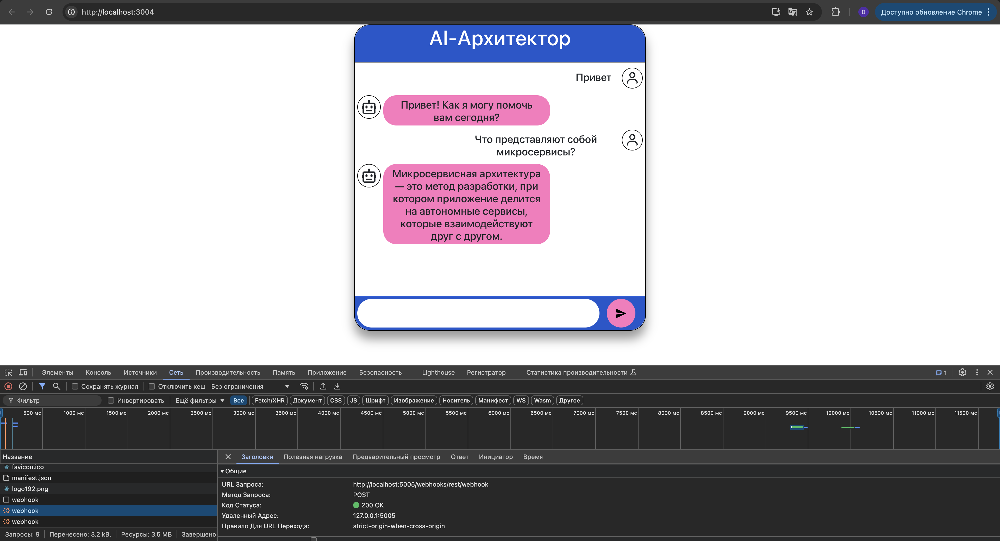
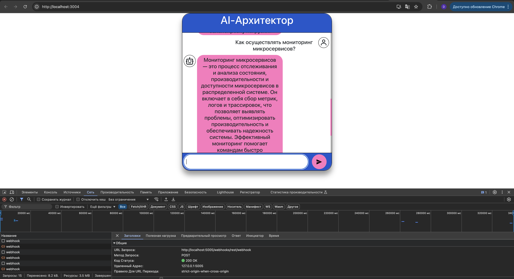

## Сдача решения

1. Настройте логирование всех запросов в конфиге Rasa. Запустите Rasa командой с параметрами rasa run --log-level DEBUG логи отображаются в терминале. Это основной способ просмотра логов в режиме реального времени.
2. Поприветствуйте ассистента в UI веб-приложения. Проконсультируйтесь с ним на тему микросервисной архитектуры (например, что это такое и как её реализовать).

   
   
   
   
   

3. Выгрузите лог Rasa в GitHub и сделайте пул-реквест.
   ```text
   /Users/daracvetkova/Downloads/architecture-sprint-5-hw/rasa_env/lib/python3.9/site-packages/rasa/core/tracker_store.py:1044: MovedIn20Warning: Deprecated API features detected! These feature(s) are not compatible with SQLAlchemy 2.0. To prevent incompatible upgrades prior to updating applications, ensure requirements files are pinned to "sqlalchemy<2.0". Set environment variable SQLALCHEMY_WARN_20=1 to show all deprecation warnings.  Set environment variable SQLALCHEMY_SILENCE_UBER_WARNING=1 to silence this message. (Background on SQLAlchemy 2.0 at: https://sqlalche.me/e/b8d9)
   Base: DeclarativeMeta = declarative_base()
   /Users/daracvetkova/Downloads/architecture-sprint-5-hw/rasa_env/lib/python3.9/site-packages/rasa/shared/utils/validation.py:134: DeprecationWarning: pkg_resources is deprecated as an API. See https://setuptools.pypa.io/en/latest/pkg_resources.html
   import pkg_resources
   /Users/daracvetkova/Downloads/architecture-sprint-5-hw/rasa_env/lib/python3.9/site-packages/pkg_resources/__init__.py:3149: DeprecationWarning: Deprecated call to `pkg_resources.declare_namespace('mpl_toolkits')`.
   Implementing implicit namespace packages (as specified in PEP 420) is preferred to `pkg_resources.declare_namespace`. See https://setuptools.pypa.io/en/latest/references/keywords.html#keyword-namespace-packages
   declare_namespace(pkg)
   /Users/daracvetkova/Downloads/architecture-sprint-5-hw/rasa_env/lib/python3.9/site-packages/pkg_resources/__init__.py:3149: DeprecationWarning: Deprecated call to `pkg_resources.declare_namespace('ruamel')`.
   Implementing implicit namespace packages (as specified in PEP 420) is preferred to `pkg_resources.declare_namespace`. See https://setuptools.pypa.io/en/latest/references/keywords.html#keyword-namespace-packages
   declare_namespace(pkg)
   2024-12-07 22:13:43 DEBUG    rasa.cli.utils  - Parameter 'credentials' not set. Using default location 'credentials.yml' instead.
   /Users/daracvetkova/Downloads/architecture-sprint-5-hw/rasa_env/lib/python3.9/site-packages/sanic_cors/extension.py:39: DeprecationWarning: distutils Version classes are deprecated. Use packaging.version instead.
   SANIC_VERSION = LooseVersion(sanic_version)
   2024-12-07 22:13:45 DEBUG    h5py._conv  - Creating converter from 7 to 5
   2024-12-07 22:13:45 DEBUG    h5py._conv  - Creating converter from 5 to 7
   2024-12-07 22:13:45 DEBUG    h5py._conv  - Creating converter from 7 to 5
   2024-12-07 22:13:45 DEBUG    h5py._conv  - Creating converter from 5 to 7
   2024-12-07 22:13:46 DEBUG    jax._src.path  - etils.epath was not found. Using pathlib for file I/O.
   /Users/daracvetkova/Downloads/architecture-sprint-5-hw/rasa_env/lib/python3.9/site-packages/tensorflow/lite/python/util.py:52: DeprecationWarning: jax.xla_computation is deprecated. Please use the AOT APIs.
   from jax import xla_computation as _xla_computation
   2024-12-07 22:13:47 DEBUG    rasa.core.utils  - Available web server routes:
   /conversations/<conversation_id:path>/messages     POST                           add_message
   /conversations/<conversation_id:path>/tracker/events POST                           append_events
   /webhooks/rasa                                     GET                            custom_webhook_RasaChatInput.health
   /webhooks/rasa/webhook                             POST                           custom_webhook_RasaChatInput.receive
   /webhooks/rest                                     GET                            custom_webhook_RestInput.health
   /webhooks/rest/webhook                             POST                           custom_webhook_RestInput.receive
   /model/test/intents                                POST                           evaluate_intents
   /model/test/stories                                POST                           evaluate_stories
   /conversations/<conversation_id:path>/execute      POST                           execute_action
   /domain                                            GET                            get_domain
   /                                                  GET                            hello
   /model                                             PUT                            load_model
   /model/parse                                       POST                           parse
   /conversations/<conversation_id:path>/predict      POST                           predict
   /conversations/<conversation_id:path>/tracker/events PUT                            replace_events
   /conversations/<conversation_id:path>/story        GET                            retrieve_story
   /conversations/<conversation_id:path>/tracker      GET                            retrieve_tracker
   /status                                            GET                            status
   /model/predict                                     POST                           tracker_predict
   /model/train                                       POST                           train
   /conversations/<conversation_id:path>/trigger_intent POST                           trigger_intent
   /model                                             DELETE                         unload_model
   /version                                           GET                            version
   2024-12-07 22:13:47 INFO     root  - Starting Rasa server on http://0.0.0.0:5005
   2024-12-07 22:13:47 DEBUG    rasa.core.utils  - Using the default number of Sanic workers (1).
   2024-12-07 22:13:47 DEBUG    rasa.telemetry  - Skipping telemetry reporting: no license hash found.
   2024-12-07 22:13:47 DEBUG    rasa.core.tracker_store  - Connected to InMemoryTrackerStore.
   2024-12-07 22:13:47 DEBUG    rasa.core.lock_store  - Connected to lock store 'InMemoryLockStore'.
   2024-12-07 22:13:47 DEBUG    rasa.core.nlg.generator  - Instantiated NLG to 'TemplatedNaturalLanguageGenerator'.
   2024-12-07 22:13:47 INFO     rasa.core.processor  - Loading model models/20241207-220706-flat-shrike.tar.gz...
   2024-12-07 22:13:47 DEBUG    rasa.engine.storage.local_model_storage  - Extracted model to '/var/folders/l7/tn_zrl2d60s4sm8v_fxk6zqw0000gn/T/tmp3hpfam06'.
   2024-12-07 22:13:47 DEBUG    rasa.engine.graph  - Node 'nlu_message_converter' loading 'NLUMessageConverter.load' and kwargs: '{}'.
   2024-12-07 22:13:47 DEBUG    rasa.engine.graph  - Node 'run_WhitespaceTokenizer0' loading 'WhitespaceTokenizer.load' and kwargs: '{}'.
   2024-12-07 22:13:47 DEBUG    rasa.engine.graph  - Node 'run_RegexFeaturizer1' loading 'RegexFeaturizer.load' and kwargs: '{}'.
   2024-12-07 22:13:47 DEBUG    rasa.engine.storage.local_model_storage  - Resource 'train_RegexFeaturizer1' was requested for reading.
   2024-12-07 22:13:47 DEBUG    rasa.engine.graph  - Node 'run_LexicalSyntacticFeaturizer2' loading 'LexicalSyntacticFeaturizer.load' and kwargs: '{}'.
   2024-12-07 22:13:47 DEBUG    rasa.engine.storage.local_model_storage  - Resource 'train_LexicalSyntacticFeaturizer2' was requested for reading.
   2024-12-07 22:13:47 DEBUG    rasa.engine.graph  - Node 'run_CountVectorsFeaturizer3' loading 'CountVectorsFeaturizer.load' and kwargs: '{}'.
   2024-12-07 22:13:47 DEBUG    rasa.engine.storage.local_model_storage  - Resource 'train_CountVectorsFeaturizer3' was requested for reading.
   2024-12-07 22:13:47 DEBUG    rasa.engine.graph  - Node 'run_LanguageModelFeaturizer4' loading 'LanguageModelFeaturizer.load' and kwargs: '{}'.
   2024-12-07 22:13:48 DEBUG    rasa.nlu.featurizers.dense_featurizer.lm_featurizer  - Loading Tokenizer and Model for bert
   2024-12-07 22:13:48 DEBUG    urllib3.connectionpool  - Starting new HTTPS connection (1): huggingface.co:443
   2024-12-07 22:13:48 DEBUG    urllib3.connectionpool  - https://huggingface.co:443 "HEAD /bert-base-cased/resolve/main/tokenizer_config.json HTTP/1.1" 200 0
   2024-12-07 22:13:48 DEBUG    urllib3.connectionpool  - https://huggingface.co:443 "HEAD /bert-base-cased/resolve/main/config.json HTTP/1.1" 200 0
   Some weights of the PyTorch model were not used when initializing the TF 2.0 model TFBertModel: ['cls.predictions.transform.LayerNorm.bias', 'cls.seq_relationship.weight', 'cls.predictions.transform.LayerNorm.weight', 'cls.seq_relationship.bias', 'cls.predictions.transform.dense.weight', 'cls.predictions.bias', 'cls.predictions.transform.dense.bias']
   - This IS expected if you are initializing TFBertModel from a PyTorch model trained on another task or with another architecture (e.g. initializing a TFBertForSequenceClassification model from a BertForPreTraining model).
   - This IS NOT expected if you are initializing TFBertModel from a PyTorch model that you expect to be exactly identical (e.g. initializing a TFBertForSequenceClassification model from a BertForSequenceClassification model).
     All the weights of TFBertModel were initialized from the PyTorch model.
     If your task is similar to the task the model of the checkpoint was trained on, you can already use TFBertModel for predictions without further training.
     2024-12-07 22:13:50 DEBUG    rasa.engine.graph  - Node 'run_DIETClassifier5' loading 'DIETClassifier.load' and kwargs: '{}'.
     2024-12-07 22:13:50 DEBUG    rasa.engine.storage.local_model_storage  - Resource 'train_DIETClassifier5' was requested for reading.
     2024-12-07 22:13:50 DEBUG    rasa.utils.tensorflow.models  - Loading the model from /var/folders/l7/tn_zrl2d60s4sm8v_fxk6zqw0000gn/T/tmp3nl2mvji/train_DIETClassifier5/DIETClassifier.tf_model with finetune_mode=False...
     2024-12-07 22:13:50 DEBUG    rasa.nlu.classifiers.diet_classifier  - You specified 'DIET' to train entities, but no entities are present in the training data. Skipping training of entities.
     2024-12-07 22:13:50 DEBUG    rasa.nlu.classifiers.diet_classifier  - Following metrics will be logged during training:
     2024-12-07 22:13:50 DEBUG    rasa.nlu.classifiers.diet_classifier  -   t_loss (total loss)
     2024-12-07 22:13:50 DEBUG    rasa.nlu.classifiers.diet_classifier  -   i_acc (intent acc)
     2024-12-07 22:13:50 DEBUG    rasa.nlu.classifiers.diet_classifier  -   i_loss (intent loss)
     2024-12-07 22:13:50 WARNING  absl  - At this time, the v2.11+ optimizer `tf.keras.optimizers.Adam` runs slowly on M1/M2 Macs, please use the legacy Keras optimizer instead, located at `tf.keras.optimizers.legacy.Adam`.
     2024-12-07 22:13:50 WARNING  absl  - There is a known slowdown when using v2.11+ Keras optimizers on M1/M2 Macs. Falling back to the legacy Keras optimizer, i.e., `tf.keras.optimizers.legacy.Adam`.
     2024-12-07 22:13:54 DEBUG    rasa.utils.tensorflow.models  - Finished loading the model.
     /Users/daracvetkova/Downloads/architecture-sprint-5-hw/rasa_env/lib/python3.9/site-packages/rasa/utils/train_utils.py:530: UserWarning: constrain_similarities is set to `False`. It is recommended to set it to `True` when using cross-entropy loss.
     rasa.shared.utils.io.raise_warning(
     2024-12-07 22:13:54 DEBUG    rasa.engine.graph  - Node 'run_EntitySynonymMapper6' loading 'EntitySynonymMapper.load' and kwargs: '{}'.
     2024-12-07 22:13:54 DEBUG    rasa.engine.storage.local_model_storage  - Resource 'train_EntitySynonymMapper6' was requested for reading.
     2024-12-07 22:13:54 DEBUG    rasa.nlu.extractors.entity_synonyms  - Failed to load ABCMeta from model storage. Resource 'train_EntitySynonymMapper6' doesn't exist.
     2024-12-07 22:13:54 DEBUG    rasa.engine.graph  - Node 'run_ResponseSelector7' loading 'ResponseSelector.load' and kwargs: '{}'.
     2024-12-07 22:13:54 DEBUG    rasa.engine.storage.local_model_storage  - Resource 'train_ResponseSelector7' was requested for reading.
     2024-12-07 22:13:54 DEBUG    rasa.nlu.classifiers.diet_classifier  - Failed to load ABCMeta from model storage. Resource 'train_ResponseSelector7' doesn't exist.
     /Users/daracvetkova/Downloads/architecture-sprint-5-hw/rasa_env/lib/python3.9/site-packages/rasa/shared/utils/io.py:99: UserWarning: 'evaluate_every_number_of_epochs=20' is greater than 'epochs=1'. No evaluation will occur.
     2024-12-07 22:13:54 DEBUG    rasa.engine.storage.local_model_storage  - Resource 'train_ResponseSelector7' was requested for reading.
     2024-12-07 22:13:54 DEBUG    rasa.nlu.selectors.response_selector  - Failed to load ResponseSelector from model storage. Resource 'train_ResponseSelector7' doesn't exist.
     2024-12-07 22:13:54 DEBUG    rasa.engine.graph  - Node 'run_RegexMessageHandler' loading 'RegexMessageHandler.load' and kwargs: '{}'.
     2024-12-07 22:13:54 DEBUG    rasa.engine.graph  - Node 'domain_provider' loading 'DomainProvider.load' and kwargs: '{}'.
     2024-12-07 22:13:54 DEBUG    rasa.engine.storage.local_model_storage  - Resource 'domain_provider' was requested for reading.
     2024-12-07 22:13:54 DEBUG    rasa.engine.graph  - Node 'run_MemoizationPolicy0' loading 'MemoizationPolicy.load' and kwargs: '{}'.
     2024-12-07 22:13:54 DEBUG    rasa.engine.storage.local_model_storage  - Resource 'train_MemoizationPolicy0' was requested for reading.
     2024-12-07 22:13:54 DEBUG    rasa.engine.graph  - Node 'run_RulePolicy1' loading 'RulePolicy.load' and kwargs: '{}'.
     2024-12-07 22:13:54 DEBUG    rasa.engine.storage.local_model_storage  - Resource 'train_RulePolicy1' was requested for reading.
     2024-12-07 22:13:54 DEBUG    rasa.engine.graph  - Node 'run_TEDPolicy2' loading 'TEDPolicy.load' and kwargs: '{}'.
     2024-12-07 22:13:54 DEBUG    rasa.engine.storage.local_model_storage  - Resource 'train_TEDPolicy2' was requested for reading.
     2024-12-07 22:13:54 DEBUG    rasa.utils.tensorflow.models  - Loading the model from /var/folders/l7/tn_zrl2d60s4sm8v_fxk6zqw0000gn/T/tmp3nl2mvji/train_TEDPolicy2/ted_policy.tf_model with finetune_mode=False...
     2024-12-07 22:13:54 WARNING  absl  - At this time, the v2.11+ optimizer `tf.keras.optimizers.Adam` runs slowly on M1/M2 Macs, please use the legacy Keras optimizer instead, located at `tf.keras.optimizers.legacy.Adam`.
     2024-12-07 22:13:54 WARNING  absl  - There is a known slowdown when using v2.11+ Keras optimizers on M1/M2 Macs. Falling back to the legacy Keras optimizer, i.e., `tf.keras.optimizers.legacy.Adam`.
     2024-12-07 22:13:58 DEBUG    rasa.utils.tensorflow.models  - Finished loading the model.
     2024-12-07 22:13:58 DEBUG    rasa.engine.graph  - Node 'rule_only_data_provider' loading 'RuleOnlyDataProvider.load' and kwargs: '{}'.
     2024-12-07 22:13:58 DEBUG    rasa.engine.storage.local_model_storage  - Resource 'train_RulePolicy1' was requested for reading.
     2024-12-07 22:13:58 DEBUG    rasa.engine.graph  - Node 'select_prediction' loading 'DefaultPolicyPredictionEnsemble.load' and kwargs: '{}'.
     2024-12-07 22:13:58 INFO     root  - Rasa server is up and running.
     2024-12-07 22:13:58 INFO     root  - Enabling coroutine debugging. Loop id 12978475312.
     2024-12-07 22:14:17 DEBUG    rasa.core.lock_store  - Issuing ticket for conversation 'PractikumStudent'.
     2024-12-07 22:14:17 DEBUG    rasa.core.lock_store  - Acquiring lock for conversation 'PractikumStudent'.
     2024-12-07 22:14:17 DEBUG    rasa.core.lock_store  - Acquired lock for conversation 'PractikumStudent'.
     2024-12-07 22:14:17 DEBUG    rasa.core.tracker_store  - Could not find tracker for conversation ID 'PractikumStudent'.
     2024-12-07 22:14:17 DEBUG    rasa.core.tracker_store  - No event broker configured. Skipping streaming events.
     2024-12-07 22:14:17 DEBUG    rasa.core.processor  - Starting a new session for conversation ID 'PractikumStudent'.
     2024-12-07 22:14:17 DEBUG    rasa.core.processor  - [debug    ] processor.actions.policy_prediction prediction_events=[]
     2024-12-07 22:14:17 DEBUG    rasa.core.processor  - [debug    ] processor.actions.log          action_name=action_session_start rasa_events=[<rasa.shared.core.events.SessionStarted object at 0x354bf67f0>, ActionExecuted(action: action_listen, policy: None, confidence: None)]
     2024-12-07 22:14:17 DEBUG    rasa.core.processor  - [debug    ] processor.slots.log            slot_values=     session_started_metadata: None
     2024-12-07 22:14:17 DEBUG    rasa.engine.runner.dask  - Running graph with inputs: {'__message__': [<rasa.core.channels.channel.UserMessage object at 0x351e48250>], '__tracker__': <rasa.shared.core.trackers.DialogueStateTracker object at 0x35699f340>}, targets: ['run_RegexMessageHandler'] and ExecutionContext(model_id='071e97477bc3421484247b584c2ea491', should_add_diagnostic_data=False, is_finetuning=False, node_name=None).
     2024-12-07 22:14:17 DEBUG    rasa.engine.graph  - Node 'nlu_message_converter' running 'NLUMessageConverter.convert_user_message'.
     2024-12-07 22:14:17 DEBUG    rasa.engine.graph  - Node 'run_WhitespaceTokenizer0' running 'WhitespaceTokenizer.process'.
     2024-12-07 22:14:17 DEBUG    rasa.engine.graph  - Node 'run_RegexFeaturizer1' running 'RegexFeaturizer.process'.
     2024-12-07 22:14:17 DEBUG    rasa.engine.graph  - Node 'run_LexicalSyntacticFeaturizer2' running 'LexicalSyntacticFeaturizer.process'.
     2024-12-07 22:14:17 DEBUG    rasa.engine.graph  - Node 'run_CountVectorsFeaturizer3' running 'CountVectorsFeaturizer.process'.
     2024-12-07 22:14:17 DEBUG    rasa.engine.graph  - Node 'run_LanguageModelFeaturizer4' running 'LanguageModelFeaturizer.process'.
     2024-12-07 22:14:17 DEBUG    rasa.engine.graph  - Node 'run_DIETClassifier5' running 'DIETClassifier.process'.
     2024-12-07 22:14:17 DEBUG    rasa.engine.graph  - Node 'run_EntitySynonymMapper6' running 'EntitySynonymMapper.process'.
     2024-12-07 22:14:17 DEBUG    rasa.engine.graph  - Node 'run_ResponseSelector7' running 'ResponseSelector.process'.
     2024-12-07 22:14:17 DEBUG    rasa.nlu.classifiers.diet_classifier  - There is no trained model for 'ResponseSelector': The component is either not trained or didn't receive enough training data.
     2024-12-07 22:14:17 DEBUG    rasa.nlu.selectors.response_selector  - Adding following selector key to message property: default
     2024-12-07 22:14:17 DEBUG    rasa.engine.graph  - Node 'domain_provider' running 'DomainProvider.provide_inference'.
     2024-12-07 22:14:17 DEBUG    rasa.engine.graph  - Node 'run_RegexMessageHandler' running 'RegexMessageHandler.process'.
     2024-12-07 22:14:17 DEBUG    rasa.core.processor  - [debug    ] processor.message.parse        parse_data_entities=[] parse_data_intent={'name': 'приветствие', 'confidence': 0.4127614200115204} parse_data_text=Привет
     2024-12-07 22:14:17 DEBUG    rasa.core.processor  - Logged UserUtterance - tracker now has 4 events.
     2024-12-07 22:14:17 DEBUG    rasa.core.actions.action  - Validating extracted slots:
     2024-12-07 22:14:17 DEBUG    rasa.core.processor  - [debug    ] processor.extract.slots        action_extract_slot=action_extract_slots len_extraction_events=0 rasa_events=[]
     2024-12-07 22:14:17 DEBUG    rasa.engine.runner.dask  - Running graph with inputs: {'__tracker__': <rasa.shared.core.trackers.DialogueStateTracker object at 0x35699f340>}, targets: ['select_prediction'] and ExecutionContext(model_id='071e97477bc3421484247b584c2ea491', should_add_diagnostic_data=False, is_finetuning=False, node_name=None).
     2024-12-07 22:14:17 DEBUG    rasa.engine.graph  - Node 'rule_only_data_provider' running 'RuleOnlyDataProvider.provide'.
     2024-12-07 22:14:17 DEBUG    rasa.engine.graph  - Node 'domain_provider' running 'DomainProvider.provide_inference'.
     2024-12-07 22:14:17 DEBUG    rasa.engine.graph  - Node 'run_MemoizationPolicy0' running 'MemoizationPolicy.predict_action_probabilities'.
     2024-12-07 22:14:17 DEBUG    rasa.core.policies.memoization  - [debug    ] memoization.predict.actions    tracker_states=[{}, {'user': {'intent': 'приветствие'}, 'prev_action': {'action_name': 'action_listen'}}]
     2024-12-07 22:14:17 DEBUG    rasa.core.policies.memoization  - There is a memorised next action 'utter_greet'
     2024-12-07 22:14:17 DEBUG    rasa.engine.graph  - Node 'run_RulePolicy1' running 'RulePolicy.predict_action_probabilities'.
     2024-12-07 22:14:17 DEBUG    rasa.core.policies.rule_policy  - [debug    ] rule_policy.actions.find       current_states=
     [state 1] user text: Привет | previous action name: action_listen
     2024-12-07 22:14:17 DEBUG    rasa.core.policies.rule_policy  - There is no applicable rule.
     2024-12-07 22:14:17 DEBUG    rasa.core.policies.rule_policy  - [debug    ] rule_policy.actions.find       current_states=
     [state 1] user intent: приветствие | previous action name: action_listen
     2024-12-07 22:14:17 DEBUG    rasa.core.policies.rule_policy  - There is a rule for the next action 'utter_greet'.
     2024-12-07 22:14:17 DEBUG    rasa.engine.graph  - Node 'run_TEDPolicy2' running 'TEDPolicy.predict_action_probabilities'.
     2024-12-07 22:14:17 DEBUG    rasa.core.policies.ted_policy  - TED predicted 'utter_tech_info' based on user intent.
     2024-12-07 22:14:17 DEBUG    rasa.engine.graph  - Node 'select_prediction' running 'DefaultPolicyPredictionEnsemble.combine_predictions_from_kwargs'.
     2024-12-07 22:14:17 DEBUG    rasa.core.policies.ensemble  - Made prediction using user intent.
     2024-12-07 22:14:17 DEBUG    rasa.core.policies.ensemble  - Added `DefinePrevUserUtteredFeaturization(False)` event.
     2024-12-07 22:14:17 DEBUG    rasa.core.policies.ensemble  - Predicted next action using RulePolicy.
     2024-12-07 22:14:17 DEBUG    rasa.core.processor  - Predicted next action 'utter_greet' with confidence 1.00.
     2024-12-07 22:14:17 DEBUG    rasa.core.processor  - [debug    ] processor.actions.policy_prediction prediction_events=[<rasa.shared.core.events.DefinePrevUserUtteredFeaturization object at 0x31eb37490>]
     2024-12-07 22:14:17 DEBUG    rasa.core.processor  - [debug    ] processor.actions.log          action_name=utter_greet rasa_events=[BotUttered('Привет! Как я могу помочь вам сегодня?', {"elements": null, "quick_replies": null, "buttons": null, "attachment": null, "image": null, "custom": null}, {"utter_action": "utter_greet"}, 1733598857.679049)]
     2024-12-07 22:14:17 DEBUG    rasa.engine.runner.dask  - Running graph with inputs: {'__tracker__': <rasa.shared.core.trackers.DialogueStateTracker object at 0x35699f340>}, targets: ['select_prediction'] and ExecutionContext(model_id='071e97477bc3421484247b584c2ea491', should_add_diagnostic_data=False, is_finetuning=False, node_name=None).
     2024-12-07 22:14:17 DEBUG    rasa.engine.graph  - Node 'rule_only_data_provider' running 'RuleOnlyDataProvider.provide'.
     2024-12-07 22:14:17 DEBUG    rasa.engine.graph  - Node 'domain_provider' running 'DomainProvider.provide_inference'.
     2024-12-07 22:14:17 DEBUG    rasa.engine.graph  - Node 'run_MemoizationPolicy0' running 'MemoizationPolicy.predict_action_probabilities'.
     2024-12-07 22:14:17 DEBUG    rasa.core.policies.memoization  - [debug    ] memoization.predict.actions    tracker_states=[{'user': {'intent': 'приветствие'}, 'prev_action': {'action_name': 'action_listen'}}, {'user': {'intent': 'приветствие'}, 'prev_action': {'action_name': 'utter_greet'}}]
     2024-12-07 22:14:17 DEBUG    rasa.core.policies.memoization  - There is a memorised next action 'action_listen'
     2024-12-07 22:14:17 DEBUG    rasa.engine.graph  - Node 'run_RulePolicy1' running 'RulePolicy.predict_action_probabilities'.
     2024-12-07 22:14:17 DEBUG    rasa.core.policies.rule_policy  - [debug    ] rule_policy.actions.find       current_states=
     [state 1] user intent: приветствие | previous action name: action_listen
     [state 2] user intent: приветствие | previous action name: utter_greet
     2024-12-07 22:14:17 DEBUG    rasa.core.policies.rule_policy  - There is a rule for the next action 'action_listen'.
     2024-12-07 22:14:17 DEBUG    rasa.engine.graph  - Node 'run_TEDPolicy2' running 'TEDPolicy.predict_action_probabilities'.
     2024-12-07 22:14:17 DEBUG    rasa.core.policies.ted_policy  - TED predicted 'action_default_fallback' based on user intent.
     2024-12-07 22:14:17 DEBUG    rasa.engine.graph  - Node 'select_prediction' running 'DefaultPolicyPredictionEnsemble.combine_predictions_from_kwargs'.
     2024-12-07 22:14:17 DEBUG    rasa.core.policies.ensemble  - Predicted next action using RulePolicy.
     2024-12-07 22:14:17 DEBUG    rasa.core.processor  - Predicted next action 'action_listen' with confidence 1.00.
     2024-12-07 22:14:17 DEBUG    rasa.core.processor  - [debug    ] processor.actions.policy_prediction prediction_events=[]
     2024-12-07 22:14:17 DEBUG    rasa.core.processor  - [debug    ] processor.actions.log          action_name=action_listen rasa_events=[]
     2024-12-07 22:14:17 DEBUG    rasa.core.tracker_store  - No event broker configured. Skipping streaming events.
     2024-12-07 22:14:17 DEBUG    rasa.core.lock_store  - Deleted lock for conversation 'PractikumStudent'.
     2024-12-07 22:14:22 DEBUG    rasa.core.lock_store  - Issuing ticket for conversation 'PractikumStudent'.
     2024-12-07 22:14:22 DEBUG    rasa.core.lock_store  - Acquiring lock for conversation 'PractikumStudent'.
     2024-12-07 22:14:22 DEBUG    rasa.core.lock_store  - Acquired lock for conversation 'PractikumStudent'.
     2024-12-07 22:14:22 DEBUG    rasa.core.tracker_store  - Recreating tracker for id 'PractikumStudent'
     2024-12-07 22:14:22 DEBUG    rasa.engine.runner.dask  - Running graph with inputs: {'__message__': [<rasa.core.channels.channel.UserMessage object at 0x351e48250>], '__tracker__': <rasa.shared.core.trackers.DialogueStateTracker object at 0x351d80c10>}, targets: ['run_RegexMessageHandler'] and ExecutionContext(model_id='071e97477bc3421484247b584c2ea491', should_add_diagnostic_data=False, is_finetuning=False, node_name=None).
     2024-12-07 22:14:22 DEBUG    rasa.engine.graph  - Node 'nlu_message_converter' running 'NLUMessageConverter.convert_user_message'.
     2024-12-07 22:14:22 DEBUG    rasa.engine.graph  - Node 'run_WhitespaceTokenizer0' running 'WhitespaceTokenizer.process'.
     2024-12-07 22:14:22 DEBUG    rasa.engine.graph  - Node 'run_RegexFeaturizer1' running 'RegexFeaturizer.process'.
     2024-12-07 22:14:22 DEBUG    rasa.engine.graph  - Node 'run_LexicalSyntacticFeaturizer2' running 'LexicalSyntacticFeaturizer.process'.
     2024-12-07 22:14:22 DEBUG    rasa.engine.graph  - Node 'run_CountVectorsFeaturizer3' running 'CountVectorsFeaturizer.process'.
     2024-12-07 22:14:22 DEBUG    rasa.engine.graph  - Node 'run_LanguageModelFeaturizer4' running 'LanguageModelFeaturizer.process'.
     2024-12-07 22:14:22 DEBUG    rasa.engine.graph  - Node 'run_DIETClassifier5' running 'DIETClassifier.process'.
     2024-12-07 22:14:22 DEBUG    rasa.engine.graph  - Node 'run_EntitySynonymMapper6' running 'EntitySynonymMapper.process'.
     2024-12-07 22:14:22 DEBUG    rasa.engine.graph  - Node 'run_ResponseSelector7' running 'ResponseSelector.process'.
     2024-12-07 22:14:22 DEBUG    rasa.nlu.classifiers.diet_classifier  - There is no trained model for 'ResponseSelector': The component is either not trained or didn't receive enough training data.
     2024-12-07 22:14:22 DEBUG    rasa.nlu.selectors.response_selector  - Adding following selector key to message property: default
     2024-12-07 22:14:22 DEBUG    rasa.engine.graph  - Node 'domain_provider' running 'DomainProvider.provide_inference'.
     2024-12-07 22:14:22 DEBUG    rasa.engine.graph  - Node 'run_RegexMessageHandler' running 'RegexMessageHandler.process'.
     2024-12-07 22:14:22 DEBUG    rasa.core.processor  - [debug    ] processor.message.parse        parse_data_entities=[] parse_data_intent={'name': 'приветствие', 'confidence': 0.11515166610479355} parse_data_text=architecture-sprint-5
     2024-12-07 22:14:22 DEBUG    rasa.core.processor  - Logged UserUtterance - tracker now has 9 events.
     2024-12-07 22:14:22 DEBUG    rasa.core.actions.action  - Validating extracted slots:
     2024-12-07 22:14:22 DEBUG    rasa.core.processor  - [debug    ] processor.extract.slots        action_extract_slot=action_extract_slots len_extraction_events=0 rasa_events=[]
     2024-12-07 22:14:22 DEBUG    rasa.engine.runner.dask  - Running graph with inputs: {'__tracker__': <rasa.shared.core.trackers.DialogueStateTracker object at 0x351d80c10>}, targets: ['select_prediction'] and ExecutionContext(model_id='071e97477bc3421484247b584c2ea491', should_add_diagnostic_data=False, is_finetuning=False, node_name=None).
     2024-12-07 22:14:22 DEBUG    rasa.engine.graph  - Node 'rule_only_data_provider' running 'RuleOnlyDataProvider.provide'.
     2024-12-07 22:14:22 DEBUG    rasa.engine.graph  - Node 'domain_provider' running 'DomainProvider.provide_inference'.
     2024-12-07 22:14:22 DEBUG    rasa.engine.graph  - Node 'run_MemoizationPolicy0' running 'MemoizationPolicy.predict_action_probabilities'.
     2024-12-07 22:14:22 DEBUG    rasa.core.policies.memoization  - [debug    ] memoization.predict.actions    tracker_states=[{'user': {'intent': 'приветствие'}, 'prev_action': {'action_name': 'utter_greet'}}, {'user': {'intent': 'приветствие'}, 'prev_action': {'action_name': 'action_listen'}}]
     2024-12-07 22:14:22 DEBUG    rasa.core.policies.memoization  - There is no memorised next action
     2024-12-07 22:14:22 DEBUG    rasa.engine.graph  - Node 'run_RulePolicy1' running 'RulePolicy.predict_action_probabilities'.
     2024-12-07 22:14:22 DEBUG    rasa.core.policies.rule_policy  - [debug    ] rule_policy.actions.find       current_states=
     [state 1] user intent: приветствие | previous action name: action_listen
     [state 2] user intent: приветствие | previous action name: utter_greet
     [state 3] user text: architecture-sprint-5 | previous action name: action_listen
     2024-12-07 22:14:22 DEBUG    rasa.core.policies.rule_policy  - There is no applicable rule.
     2024-12-07 22:14:22 DEBUG    rasa.core.policies.rule_policy  - [debug    ] rule_policy.actions.find       current_states=
     [state 1] user intent: приветствие | previous action name: action_listen
     [state 2] user intent: приветствие | previous action name: utter_greet
     [state 3] user intent: приветствие | previous action name: action_listen
     2024-12-07 22:14:22 DEBUG    rasa.core.policies.rule_policy  - There is a rule for the next action 'utter_greet'.
     2024-12-07 22:14:22 DEBUG    rasa.engine.graph  - Node 'run_TEDPolicy2' running 'TEDPolicy.predict_action_probabilities'.
     2024-12-07 22:14:22 DEBUG    rasa.core.policies.ted_policy  - TED predicted 'utter_tech_info' based on user intent.
     2024-12-07 22:14:22 DEBUG    rasa.engine.graph  - Node 'select_prediction' running 'DefaultPolicyPredictionEnsemble.combine_predictions_from_kwargs'.
     2024-12-07 22:14:22 DEBUG    rasa.core.policies.ensemble  - Made prediction using user intent.
     2024-12-07 22:14:22 DEBUG    rasa.core.policies.ensemble  - Added `DefinePrevUserUtteredFeaturization(False)` event.
     2024-12-07 22:14:22 DEBUG    rasa.core.policies.ensemble  - Predicted next action using RulePolicy.
     2024-12-07 22:14:22 DEBUG    rasa.core.processor  - Predicted next action 'utter_greet' with confidence 1.00.
     2024-12-07 22:14:22 DEBUG    rasa.core.processor  - [debug    ] processor.actions.policy_prediction prediction_events=[<rasa.shared.core.events.DefinePrevUserUtteredFeaturization object at 0x34fb37c70>]
     2024-12-07 22:14:22 DEBUG    rasa.core.processor  - [debug    ] processor.actions.log          action_name=utter_greet rasa_events=[BotUttered('Привет! Как я могу помочь вам сегодня?', {"elements": null, "quick_replies": null, "buttons": null, "attachment": null, "image": null, "custom": null}, {"utter_action": "utter_greet"}, 1733598862.8269172)]
     2024-12-07 22:14:22 DEBUG    rasa.engine.runner.dask  - Running graph with inputs: {'__tracker__': <rasa.shared.core.trackers.DialogueStateTracker object at 0x351d80c10>}, targets: ['select_prediction'] and ExecutionContext(model_id='071e97477bc3421484247b584c2ea491', should_add_diagnostic_data=False, is_finetuning=False, node_name=None).
     2024-12-07 22:14:22 DEBUG    rasa.engine.graph  - Node 'rule_only_data_provider' running 'RuleOnlyDataProvider.provide'.
     2024-12-07 22:14:22 DEBUG    rasa.engine.graph  - Node 'domain_provider' running 'DomainProvider.provide_inference'.
     2024-12-07 22:14:22 DEBUG    rasa.engine.graph  - Node 'run_MemoizationPolicy0' running 'MemoizationPolicy.predict_action_probabilities'.
     2024-12-07 22:14:22 DEBUG    rasa.core.policies.memoization  - [debug    ] memoization.predict.actions    tracker_states=[{'user': {'intent': 'приветствие'}, 'prev_action': {'action_name': 'action_listen'}}, {'user': {'intent': 'приветствие'}, 'prev_action': {'action_name': 'utter_greet'}}]
     2024-12-07 22:14:22 DEBUG    rasa.core.policies.memoization  - There is a memorised next action 'action_listen'
     2024-12-07 22:14:22 DEBUG    rasa.engine.graph  - Node 'run_RulePolicy1' running 'RulePolicy.predict_action_probabilities'.
     2024-12-07 22:14:22 DEBUG    rasa.core.policies.rule_policy  - [debug    ] rule_policy.actions.find       current_states=
     [state 1] user intent: приветствие | previous action name: action_listen
     [state 2] user intent: приветствие | previous action name: utter_greet
     [state 3] user intent: приветствие | previous action name: action_listen
     [state 4] user intent: приветствие | previous action name: utter_greet
     2024-12-07 22:14:22 DEBUG    rasa.core.policies.rule_policy  - There is a rule for the next action 'action_listen'.
     2024-12-07 22:14:22 DEBUG    rasa.engine.graph  - Node 'run_TEDPolicy2' running 'TEDPolicy.predict_action_probabilities'.
     2024-12-07 22:14:22 DEBUG    rasa.core.policies.ted_policy  - TED predicted 'action_default_fallback' based on user intent.
     2024-12-07 22:14:22 DEBUG    rasa.engine.graph  - Node 'select_prediction' running 'DefaultPolicyPredictionEnsemble.combine_predictions_from_kwargs'.
     2024-12-07 22:14:22 DEBUG    rasa.core.policies.ensemble  - Predicted next action using RulePolicy.
     2024-12-07 22:14:22 DEBUG    rasa.core.processor  - Predicted next action 'action_listen' with confidence 1.00.
     2024-12-07 22:14:22 DEBUG    rasa.core.processor  - [debug    ] processor.actions.policy_prediction prediction_events=[]
     2024-12-07 22:14:22 DEBUG    rasa.core.processor  - [debug    ] processor.actions.log          action_name=action_listen rasa_events=[]
     2024-12-07 22:14:22 DEBUG    rasa.core.tracker_store  - No event broker configured. Skipping streaming events.
     2024-12-07 22:14:22 DEBUG    rasa.core.lock_store  - Deleted lock for conversation 'PractikumStudent'.
     2024-12-07 22:14:33 DEBUG    rasa.core.lock_store  - Issuing ticket for conversation 'PractikumStudent'.
     2024-12-07 22:14:33 DEBUG    rasa.core.lock_store  - Acquiring lock for conversation 'PractikumStudent'.
     2024-12-07 22:14:33 DEBUG    rasa.core.lock_store  - Acquired lock for conversation 'PractikumStudent'.
     2024-12-07 22:14:33 DEBUG    rasa.core.tracker_store  - Recreating tracker for id 'PractikumStudent'
     2024-12-07 22:14:33 DEBUG    rasa.engine.runner.dask  - Running graph with inputs: {'__message__': [<rasa.core.channels.channel.UserMessage object at 0x354e5d070>], '__tracker__': <rasa.shared.core.trackers.DialogueStateTracker object at 0x34fb377f0>}, targets: ['run_RegexMessageHandler'] and ExecutionContext(model_id='071e97477bc3421484247b584c2ea491', should_add_diagnostic_data=False, is_finetuning=False, node_name=None).
     2024-12-07 22:14:33 DEBUG    rasa.engine.graph  - Node 'nlu_message_converter' running 'NLUMessageConverter.convert_user_message'.
     2024-12-07 22:14:33 DEBUG    rasa.engine.graph  - Node 'run_WhitespaceTokenizer0' running 'WhitespaceTokenizer.process'.
     2024-12-07 22:14:33 DEBUG    rasa.engine.graph  - Node 'run_RegexFeaturizer1' running 'RegexFeaturizer.process'.
     2024-12-07 22:14:33 DEBUG    rasa.engine.graph  - Node 'run_LexicalSyntacticFeaturizer2' running 'LexicalSyntacticFeaturizer.process'.
     2024-12-07 22:14:33 DEBUG    rasa.engine.graph  - Node 'run_CountVectorsFeaturizer3' running 'CountVectorsFeaturizer.process'.
     2024-12-07 22:14:33 DEBUG    rasa.engine.graph  - Node 'run_LanguageModelFeaturizer4' running 'LanguageModelFeaturizer.process'.
     2024-12-07 22:14:33 DEBUG    rasa.engine.graph  - Node 'run_DIETClassifier5' running 'DIETClassifier.process'.
     2024-12-07 22:14:33 DEBUG    rasa.engine.graph  - Node 'run_EntitySynonymMapper6' running 'EntitySynonymMapper.process'.
     2024-12-07 22:14:33 DEBUG    rasa.engine.graph  - Node 'run_ResponseSelector7' running 'ResponseSelector.process'.
     2024-12-07 22:14:33 DEBUG    rasa.nlu.classifiers.diet_classifier  - There is no trained model for 'ResponseSelector': The component is either not trained or didn't receive enough training data.
     2024-12-07 22:14:33 DEBUG    rasa.nlu.selectors.response_selector  - Adding following selector key to message property: default
     2024-12-07 22:14:33 DEBUG    rasa.engine.graph  - Node 'domain_provider' running 'DomainProvider.provide_inference'.
     2024-12-07 22:14:33 DEBUG    rasa.engine.graph  - Node 'run_RegexMessageHandler' running 'RegexMessageHandler.process'.
     2024-12-07 22:14:33 DEBUG    rasa.core.processor  - [debug    ] processor.message.parse        parse_data_entities=[] parse_data_intent={'name': 'приветствие', 'confidence': 0.4127614200115204} parse_data_text=Привет
     2024-12-07 22:14:33 DEBUG    rasa.core.processor  - Logged UserUtterance - tracker now has 14 events.
     2024-12-07 22:14:33 DEBUG    rasa.core.actions.action  - Validating extracted slots:
     2024-12-07 22:14:33 DEBUG    rasa.core.processor  - [debug    ] processor.extract.slots        action_extract_slot=action_extract_slots len_extraction_events=0 rasa_events=[]
     2024-12-07 22:14:33 DEBUG    rasa.engine.runner.dask  - Running graph with inputs: {'__tracker__': <rasa.shared.core.trackers.DialogueStateTracker object at 0x34fb377f0>}, targets: ['select_prediction'] and ExecutionContext(model_id='071e97477bc3421484247b584c2ea491', should_add_diagnostic_data=False, is_finetuning=False, node_name=None).
     2024-12-07 22:14:33 DEBUG    rasa.engine.graph  - Node 'rule_only_data_provider' running 'RuleOnlyDataProvider.provide'.
     2024-12-07 22:14:33 DEBUG    rasa.engine.graph  - Node 'domain_provider' running 'DomainProvider.provide_inference'.
     2024-12-07 22:14:33 DEBUG    rasa.engine.graph  - Node 'run_MemoizationPolicy0' running 'MemoizationPolicy.predict_action_probabilities'.
     2024-12-07 22:14:33 DEBUG    rasa.core.policies.memoization  - [debug    ] memoization.predict.actions    tracker_states=[{'user': {'intent': 'приветствие'}, 'prev_action': {'action_name': 'utter_greet'}}, {'user': {'intent': 'приветствие'}, 'prev_action': {'action_name': 'action_listen'}}]
     2024-12-07 22:14:33 DEBUG    rasa.core.policies.memoization  - There is no memorised next action
     2024-12-07 22:14:33 DEBUG    rasa.engine.graph  - Node 'run_RulePolicy1' running 'RulePolicy.predict_action_probabilities'.
     2024-12-07 22:14:33 DEBUG    rasa.core.policies.rule_policy  - [debug    ] rule_policy.actions.find       current_states=
     [state 1] user intent: приветствие | previous action name: action_listen
     [state 2] user intent: приветствие | previous action name: utter_greet
     [state 3] user intent: приветствие | previous action name: action_listen
     [state 4] user intent: приветствие | previous action name: utter_greet
     [state 5] user text: Привет | previous action name: action_listen
     2024-12-07 22:14:33 DEBUG    rasa.core.policies.rule_policy  - There is no applicable rule.
     2024-12-07 22:14:33 DEBUG    rasa.core.policies.rule_policy  - [debug    ] rule_policy.actions.find       current_states=
     [state 1] user intent: приветствие | previous action name: action_listen
     [state 2] user intent: приветствие | previous action name: utter_greet
     [state 3] user intent: приветствие | previous action name: action_listen
     [state 4] user intent: приветствие | previous action name: utter_greet
     [state 5] user intent: приветствие | previous action name: action_listen
     2024-12-07 22:14:33 DEBUG    rasa.core.policies.rule_policy  - There is a rule for the next action 'utter_greet'.
     2024-12-07 22:14:33 DEBUG    rasa.engine.graph  - Node 'run_TEDPolicy2' running 'TEDPolicy.predict_action_probabilities'.
     2024-12-07 22:14:33 DEBUG    rasa.core.policies.ted_policy  - TED predicted 'utter_tech_info' based on user intent.
     2024-12-07 22:14:33 DEBUG    rasa.engine.graph  - Node 'select_prediction' running 'DefaultPolicyPredictionEnsemble.combine_predictions_from_kwargs'.
     2024-12-07 22:14:33 DEBUG    rasa.core.policies.ensemble  - Made prediction using user intent.
     2024-12-07 22:14:33 DEBUG    rasa.core.policies.ensemble  - Added `DefinePrevUserUtteredFeaturization(False)` event.
     2024-12-07 22:14:33 DEBUG    rasa.core.policies.ensemble  - Predicted next action using RulePolicy.
     2024-12-07 22:14:33 DEBUG    rasa.core.processor  - Predicted next action 'utter_greet' with confidence 1.00.
     2024-12-07 22:14:33 DEBUG    rasa.core.processor  - [debug    ] processor.actions.policy_prediction prediction_events=[<rasa.shared.core.events.DefinePrevUserUtteredFeaturization object at 0x354b58ac0>]
     2024-12-07 22:14:33 DEBUG    rasa.core.processor  - [debug    ] processor.actions.log          action_name=utter_greet rasa_events=[BotUttered('Привет! Как я могу помочь вам сегодня?', {"elements": null, "quick_replies": null, "buttons": null, "attachment": null, "image": null, "custom": null}, {"utter_action": "utter_greet"}, 1733598873.745746)]
     2024-12-07 22:14:33 DEBUG    rasa.engine.runner.dask  - Running graph with inputs: {'__tracker__': <rasa.shared.core.trackers.DialogueStateTracker object at 0x34fb377f0>}, targets: ['select_prediction'] and ExecutionContext(model_id='071e97477bc3421484247b584c2ea491', should_add_diagnostic_data=False, is_finetuning=False, node_name=None).
     2024-12-07 22:14:33 DEBUG    rasa.engine.graph  - Node 'rule_only_data_provider' running 'RuleOnlyDataProvider.provide'.
     2024-12-07 22:14:33 DEBUG    rasa.engine.graph  - Node 'domain_provider' running 'DomainProvider.provide_inference'.
     2024-12-07 22:14:33 DEBUG    rasa.engine.graph  - Node 'run_MemoizationPolicy0' running 'MemoizationPolicy.predict_action_probabilities'.
     2024-12-07 22:14:33 DEBUG    rasa.core.policies.memoization  - [debug    ] memoization.predict.actions    tracker_states=[{'user': {'intent': 'приветствие'}, 'prev_action': {'action_name': 'action_listen'}}, {'user': {'intent': 'приветствие'}, 'prev_action': {'action_name': 'utter_greet'}}]
     2024-12-07 22:14:33 DEBUG    rasa.core.policies.memoization  - There is a memorised next action 'action_listen'
     2024-12-07 22:14:33 DEBUG    rasa.engine.graph  - Node 'run_RulePolicy1' running 'RulePolicy.predict_action_probabilities'.
     2024-12-07 22:14:33 DEBUG    rasa.core.policies.rule_policy  - [debug    ] rule_policy.actions.find       current_states=
     [state 1] user intent: приветствие | previous action name: action_listen
     [state 2] user intent: приветствие | previous action name: utter_greet
     [state 3] user intent: приветствие | previous action name: action_listen
     [state 4] user intent: приветствие | previous action name: utter_greet
     [state 5] user intent: приветствие | previous action name: action_listen
     [state 6] user intent: приветствие | previous action name: utter_greet
     2024-12-07 22:14:33 DEBUG    rasa.core.policies.rule_policy  - There is a rule for the next action 'action_listen'.
     2024-12-07 22:14:33 DEBUG    rasa.engine.graph  - Node 'run_TEDPolicy2' running 'TEDPolicy.predict_action_probabilities'.
     2024-12-07 22:14:33 DEBUG    rasa.core.policies.ted_policy  - TED predicted 'action_default_fallback' based on user intent.
     2024-12-07 22:14:33 DEBUG    rasa.engine.graph  - Node 'select_prediction' running 'DefaultPolicyPredictionEnsemble.combine_predictions_from_kwargs'.
     2024-12-07 22:14:33 DEBUG    rasa.core.policies.ensemble  - Predicted next action using RulePolicy.
     2024-12-07 22:14:33 DEBUG    rasa.core.processor  - Predicted next action 'action_listen' with confidence 1.00.
     2024-12-07 22:14:33 DEBUG    rasa.core.processor  - [debug    ] processor.actions.policy_prediction prediction_events=[]
     2024-12-07 22:14:33 DEBUG    rasa.core.processor  - [debug    ] processor.actions.log          action_name=action_listen rasa_events=[]
     2024-12-07 22:14:33 DEBUG    rasa.core.tracker_store  - No event broker configured. Skipping streaming events.
     2024-12-07 22:14:33 DEBUG    rasa.core.lock_store  - Deleted lock for conversation 'PractikumStudent'.
     2024-12-07 22:14:34 DEBUG    rasa.core.lock_store  - Issuing ticket for conversation 'PractikumStudent'.
     2024-12-07 22:14:34 DEBUG    rasa.core.lock_store  - Acquiring lock for conversation 'PractikumStudent'.
     2024-12-07 22:14:34 DEBUG    rasa.core.lock_store  - Acquired lock for conversation 'PractikumStudent'.
     2024-12-07 22:14:34 DEBUG    rasa.core.tracker_store  - Recreating tracker for id 'PractikumStudent'
     2024-12-07 22:14:34 DEBUG    rasa.engine.runner.dask  - Running graph with inputs: {'__message__': [<rasa.core.channels.channel.UserMessage object at 0x354e5dc10>], '__tracker__': <rasa.shared.core.trackers.DialogueStateTracker object at 0x355b59c40>}, targets: ['run_RegexMessageHandler'] and ExecutionContext(model_id='071e97477bc3421484247b584c2ea491', should_add_diagnostic_data=False, is_finetuning=False, node_name=None).
     2024-12-07 22:14:34 DEBUG    rasa.engine.graph  - Node 'nlu_message_converter' running 'NLUMessageConverter.convert_user_message'.
     2024-12-07 22:14:34 DEBUG    rasa.engine.graph  - Node 'run_WhitespaceTokenizer0' running 'WhitespaceTokenizer.process'.
     2024-12-07 22:14:34 DEBUG    rasa.engine.graph  - Node 'run_RegexFeaturizer1' running 'RegexFeaturizer.process'.
     2024-12-07 22:14:34 DEBUG    rasa.engine.graph  - Node 'run_LexicalSyntacticFeaturizer2' running 'LexicalSyntacticFeaturizer.process'.
     2024-12-07 22:14:34 DEBUG    rasa.engine.graph  - Node 'run_CountVectorsFeaturizer3' running 'CountVectorsFeaturizer.process'.
     2024-12-07 22:14:34 DEBUG    rasa.engine.graph  - Node 'run_LanguageModelFeaturizer4' running 'LanguageModelFeaturizer.process'.
     2024-12-07 22:14:34 DEBUG    rasa.engine.graph  - Node 'run_DIETClassifier5' running 'DIETClassifier.process'.
     2024-12-07 22:14:34 DEBUG    rasa.engine.graph  - Node 'run_EntitySynonymMapper6' running 'EntitySynonymMapper.process'.
     2024-12-07 22:14:34 DEBUG    rasa.engine.graph  - Node 'run_ResponseSelector7' running 'ResponseSelector.process'.
     2024-12-07 22:14:34 DEBUG    rasa.nlu.classifiers.diet_classifier  - There is no trained model for 'ResponseSelector': The component is either not trained or didn't receive enough training data.
     2024-12-07 22:14:34 DEBUG    rasa.nlu.selectors.response_selector  - Adding following selector key to message property: default
     2024-12-07 22:14:34 DEBUG    rasa.engine.graph  - Node 'domain_provider' running 'DomainProvider.provide_inference'.
     2024-12-07 22:14:34 DEBUG    rasa.engine.graph  - Node 'run_RegexMessageHandler' running 'RegexMessageHandler.process'.
     2024-12-07 22:14:34 DEBUG    rasa.core.processor  - [debug    ] processor.message.parse        parse_data_entities=[] parse_data_intent={'name': 'микросервисы', 'confidence': 0.39427947998046875} parse_data_text=Что представляют собой микросервисы?
     2024-12-07 22:14:34 DEBUG    rasa.core.processor  - Logged UserUtterance - tracker now has 19 events.
     2024-12-07 22:14:34 DEBUG    rasa.core.actions.action  - Validating extracted slots:
     2024-12-07 22:14:34 DEBUG    rasa.core.processor  - [debug    ] processor.extract.slots        action_extract_slot=action_extract_slots len_extraction_events=0 rasa_events=[]
     2024-12-07 22:14:34 DEBUG    rasa.engine.runner.dask  - Running graph with inputs: {'__tracker__': <rasa.shared.core.trackers.DialogueStateTracker object at 0x355b59c40>}, targets: ['select_prediction'] and ExecutionContext(model_id='071e97477bc3421484247b584c2ea491', should_add_diagnostic_data=False, is_finetuning=False, node_name=None).
     2024-12-07 22:14:34 DEBUG    rasa.engine.graph  - Node 'rule_only_data_provider' running 'RuleOnlyDataProvider.provide'.
     2024-12-07 22:14:34 DEBUG    rasa.engine.graph  - Node 'domain_provider' running 'DomainProvider.provide_inference'.
     2024-12-07 22:14:34 DEBUG    rasa.engine.graph  - Node 'run_MemoizationPolicy0' running 'MemoizationPolicy.predict_action_probabilities'.
     2024-12-07 22:14:34 DEBUG    rasa.core.policies.memoization  - [debug    ] memoization.predict.actions    tracker_states=[{'user': {'intent': 'приветствие'}, 'prev_action': {'action_name': 'utter_greet'}}, {'user': {'intent': 'микросервисы'}, 'prev_action': {'action_name': 'action_listen'}}]
     2024-12-07 22:14:34 DEBUG    rasa.core.policies.memoization  - There is no memorised next action
     2024-12-07 22:14:34 DEBUG    rasa.engine.graph  - Node 'run_RulePolicy1' running 'RulePolicy.predict_action_probabilities'.
     2024-12-07 22:14:34 DEBUG    rasa.core.policies.rule_policy  - [debug    ] rule_policy.actions.find       current_states=
     [state 1] user intent: приветствие | previous action name: action_listen
     [state 2] user intent: приветствие | previous action name: utter_greet
     [state 3] user intent: приветствие | previous action name: action_listen
     [state 4] user intent: приветствие | previous action name: utter_greet
     [state 5] user intent: приветствие | previous action name: action_listen
     [state 6] user intent: приветствие | previous action name: utter_greet
     [state 7] user text: Что представляют собой микросервисы? | previous action name: action_listen
     2024-12-07 22:14:34 DEBUG    rasa.core.policies.rule_policy  - There is no applicable rule.
     2024-12-07 22:14:34 DEBUG    rasa.core.policies.rule_policy  - [debug    ] rule_policy.actions.find       current_states=
     [state 1] user intent: приветствие | previous action name: action_listen
     [state 2] user intent: приветствие | previous action name: utter_greet
     [state 3] user intent: приветствие | previous action name: action_listen
     [state 4] user intent: приветствие | previous action name: utter_greet
     [state 5] user intent: приветствие | previous action name: action_listen
     [state 6] user intent: приветствие | previous action name: utter_greet
     [state 7] user intent: микросервисы | previous action name: action_listen
     2024-12-07 22:14:34 DEBUG    rasa.core.policies.rule_policy  - There is a rule for the next action 'utter_microservices'.
     2024-12-07 22:14:34 DEBUG    rasa.engine.graph  - Node 'run_TEDPolicy2' running 'TEDPolicy.predict_action_probabilities'.
     2024-12-07 22:14:34 DEBUG    rasa.core.policies.ted_policy  - TED predicted 'action_default_fallback' based on user intent.
     2024-12-07 22:14:34 DEBUG    rasa.engine.graph  - Node 'select_prediction' running 'DefaultPolicyPredictionEnsemble.combine_predictions_from_kwargs'.
     2024-12-07 22:14:34 DEBUG    rasa.core.policies.ensemble  - Made prediction using user intent.
     2024-12-07 22:14:34 DEBUG    rasa.core.policies.ensemble  - Added `DefinePrevUserUtteredFeaturization(False)` event.
     2024-12-07 22:14:34 DEBUG    rasa.core.policies.ensemble  - Predicted next action using RulePolicy.
     2024-12-07 22:14:34 DEBUG    rasa.core.processor  - Predicted next action 'utter_microservices' with confidence 1.00.
     2024-12-07 22:14:34 DEBUG    rasa.core.processor  - [debug    ] processor.actions.policy_prediction prediction_events=[<rasa.shared.core.events.DefinePrevUserUtteredFeaturization object at 0x354bf61c0>]
     2024-12-07 22:14:34 DEBUG    rasa.core.processor  - [debug    ] processor.actions.log          action_name=utter_microservices rasa_events=[BotUttered('Микросервисная архитектура — это метод разработки, при котором приложение делится на автономные сервисы, которые взаимодействуют друг с другом.', {"elements": null, "quick_replies": null, "buttons": null, "attachment": null, "image": null, "custom": null}, {"utter_action": "utter_microservices"}, 1733598874.356718)]
     2024-12-07 22:14:34 DEBUG    rasa.engine.runner.dask  - Running graph with inputs: {'__tracker__': <rasa.shared.core.trackers.DialogueStateTracker object at 0x355b59c40>}, targets: ['select_prediction'] and ExecutionContext(model_id='071e97477bc3421484247b584c2ea491', should_add_diagnostic_data=False, is_finetuning=False, node_name=None).
     2024-12-07 22:14:34 DEBUG    rasa.engine.graph  - Node 'rule_only_data_provider' running 'RuleOnlyDataProvider.provide'.
     2024-12-07 22:14:34 DEBUG    rasa.engine.graph  - Node 'domain_provider' running 'DomainProvider.provide_inference'.
     2024-12-07 22:14:34 DEBUG    rasa.engine.graph  - Node 'run_MemoizationPolicy0' running 'MemoizationPolicy.predict_action_probabilities'.
     2024-12-07 22:14:34 DEBUG    rasa.core.policies.memoization  - [debug    ] memoization.predict.actions    tracker_states=[{'user': {'intent': 'микросервисы'}, 'prev_action': {'action_name': 'action_listen'}}, {'user': {'intent': 'микросервисы'}, 'prev_action': {'action_name': 'utter_microservices'}}]
     2024-12-07 22:14:34 DEBUG    rasa.core.policies.memoization  - There is a memorised next action 'action_listen'
     2024-12-07 22:14:34 DEBUG    rasa.engine.graph  - Node 'run_RulePolicy1' running 'RulePolicy.predict_action_probabilities'.
     2024-12-07 22:14:34 DEBUG    rasa.core.policies.rule_policy  - [debug    ] rule_policy.actions.find       current_states=
     [state 1] user intent: приветствие | previous action name: action_listen
     [state 2] user intent: приветствие | previous action name: utter_greet
     [state 3] user intent: приветствие | previous action name: action_listen
     [state 4] user intent: приветствие | previous action name: utter_greet
     [state 5] user intent: приветствие | previous action name: action_listen
     [state 6] user intent: приветствие | previous action name: utter_greet
     [state 7] user intent: микросервисы | previous action name: action_listen
     [state 8] user intent: микросервисы | previous action name: utter_microservices
     2024-12-07 22:14:34 DEBUG    rasa.core.policies.rule_policy  - There is a rule for the next action 'action_listen'.
     2024-12-07 22:14:34 DEBUG    rasa.engine.graph  - Node 'run_TEDPolicy2' running 'TEDPolicy.predict_action_probabilities'.
     2024-12-07 22:14:34 DEBUG    rasa.core.policies.ted_policy  - TED predicted 'utter_database_choice' based on user intent.
     2024-12-07 22:14:34 DEBUG    rasa.engine.graph  - Node 'select_prediction' running 'DefaultPolicyPredictionEnsemble.combine_predictions_from_kwargs'.
     2024-12-07 22:14:34 DEBUG    rasa.core.policies.ensemble  - Predicted next action using RulePolicy.
     2024-12-07 22:14:34 DEBUG    rasa.core.processor  - Predicted next action 'action_listen' with confidence 1.00.
     2024-12-07 22:14:34 DEBUG    rasa.core.processor  - [debug    ] processor.actions.policy_prediction prediction_events=[]
     2024-12-07 22:14:34 DEBUG    rasa.core.processor  - [debug    ] processor.actions.log          action_name=action_listen rasa_events=[]
     2024-12-07 22:14:34 DEBUG    rasa.core.tracker_store  - No event broker configured. Skipping streaming events.
     2024-12-07 22:14:34 DEBUG    rasa.core.lock_store  - Deleted lock for conversation 'PractikumStudent'.
     2024-12-07 22:18:45 DEBUG    rasa.core.lock_store  - Issuing ticket for conversation 'PractikumStudent'.
     2024-12-07 22:18:45 DEBUG    rasa.core.lock_store  - Acquiring lock for conversation 'PractikumStudent'.
     2024-12-07 22:18:45 DEBUG    rasa.core.lock_store  - Acquired lock for conversation 'PractikumStudent'.
     2024-12-07 22:18:45 DEBUG    rasa.core.tracker_store  - Recreating tracker for id 'PractikumStudent'
     2024-12-07 22:18:45 DEBUG    rasa.engine.runner.dask  - Running graph with inputs: {'__message__': [<rasa.core.channels.channel.UserMessage object at 0x3542089d0>], '__tracker__': <rasa.shared.core.trackers.DialogueStateTracker object at 0x354e75280>}, targets: ['run_RegexMessageHandler'] and ExecutionContext(model_id='071e97477bc3421484247b584c2ea491', should_add_diagnostic_data=False, is_finetuning=False, node_name=None).
     2024-12-07 22:18:45 DEBUG    rasa.engine.graph  - Node 'nlu_message_converter' running 'NLUMessageConverter.convert_user_message'.
     2024-12-07 22:18:45 DEBUG    rasa.engine.graph  - Node 'run_WhitespaceTokenizer0' running 'WhitespaceTokenizer.process'.
     2024-12-07 22:18:45 DEBUG    rasa.engine.graph  - Node 'run_RegexFeaturizer1' running 'RegexFeaturizer.process'.
     2024-12-07 22:18:45 DEBUG    rasa.engine.graph  - Node 'run_LexicalSyntacticFeaturizer2' running 'LexicalSyntacticFeaturizer.process'.
     2024-12-07 22:18:45 DEBUG    rasa.engine.graph  - Node 'run_CountVectorsFeaturizer3' running 'CountVectorsFeaturizer.process'.
     2024-12-07 22:18:45 DEBUG    rasa.engine.graph  - Node 'run_LanguageModelFeaturizer4' running 'LanguageModelFeaturizer.process'.
     2024-12-07 22:18:45 DEBUG    rasa.engine.graph  - Node 'run_DIETClassifier5' running 'DIETClassifier.process'.
     2024-12-07 22:18:45 DEBUG    rasa.engine.graph  - Node 'run_EntitySynonymMapper6' running 'EntitySynonymMapper.process'.
     2024-12-07 22:18:45 DEBUG    rasa.engine.graph  - Node 'run_ResponseSelector7' running 'ResponseSelector.process'.
     2024-12-07 22:18:45 DEBUG    rasa.nlu.classifiers.diet_classifier  - There is no trained model for 'ResponseSelector': The component is either not trained or didn't receive enough training data.
     2024-12-07 22:18:45 DEBUG    rasa.nlu.selectors.response_selector  - Adding following selector key to message property: default
     2024-12-07 22:18:45 DEBUG    rasa.engine.graph  - Node 'domain_provider' running 'DomainProvider.provide_inference'.
     2024-12-07 22:18:45 DEBUG    rasa.engine.graph  - Node 'run_RegexMessageHandler' running 'RegexMessageHandler.process'.
     2024-12-07 22:18:45 DEBUG    rasa.core.processor  - [debug    ] processor.message.parse        parse_data_entities=[] parse_data_intent={'name': 'обмен_данных', 'confidence': 0.17011238634586334} parse_data_text=Как избежать проблем с несовместимостью при интеграции?
     2024-12-07 22:18:45 DEBUG    rasa.core.processor  - Logged UserUtterance - tracker now has 24 events.
     2024-12-07 22:18:45 DEBUG    rasa.core.actions.action  - Validating extracted slots:
     2024-12-07 22:18:45 DEBUG    rasa.core.processor  - [debug    ] processor.extract.slots        action_extract_slot=action_extract_slots len_extraction_events=0 rasa_events=[]
     2024-12-07 22:18:45 DEBUG    rasa.engine.runner.dask  - Running graph with inputs: {'__tracker__': <rasa.shared.core.trackers.DialogueStateTracker object at 0x354e75280>}, targets: ['select_prediction'] and ExecutionContext(model_id='071e97477bc3421484247b584c2ea491', should_add_diagnostic_data=False, is_finetuning=False, node_name=None).
     2024-12-07 22:18:45 DEBUG    rasa.engine.graph  - Node 'rule_only_data_provider' running 'RuleOnlyDataProvider.provide'.
     2024-12-07 22:18:45 DEBUG    rasa.engine.graph  - Node 'domain_provider' running 'DomainProvider.provide_inference'.
     2024-12-07 22:18:45 DEBUG    rasa.engine.graph  - Node 'run_MemoizationPolicy0' running 'MemoizationPolicy.predict_action_probabilities'.
     2024-12-07 22:18:45 DEBUG    rasa.core.policies.memoization  - [debug    ] memoization.predict.actions    tracker_states=[{'user': {'intent': 'микросервисы'}, 'prev_action': {'action_name': 'utter_microservices'}}, {'user': {'intent': 'обмен_данных'}, 'prev_action': {'action_name': 'action_listen'}}]
     2024-12-07 22:18:45 DEBUG    rasa.core.policies.memoization  - There is no memorised next action
     2024-12-07 22:18:45 DEBUG    rasa.engine.graph  - Node 'run_RulePolicy1' running 'RulePolicy.predict_action_probabilities'.
     2024-12-07 22:18:45 DEBUG    rasa.core.policies.rule_policy  - [debug    ] rule_policy.actions.find       current_states=
     [state 1] user intent: приветствие | previous action name: action_listen
     [state 2] user intent: приветствие | previous action name: utter_greet
     [state 3] user intent: приветствие | previous action name: action_listen
     [state 4] user intent: приветствие | previous action name: utter_greet
     [state 5] user intent: приветствие | previous action name: action_listen
     [state 6] user intent: приветствие | previous action name: utter_greet
     [state 7] user intent: микросервисы | previous action name: action_listen
     [state 8] user intent: микросервисы | previous action name: utter_microservices
     [state 9] user text: Как избежать проблем с несовместимостью при интеграции? | previous action name: action_listen
     2024-12-07 22:18:45 DEBUG    rasa.core.policies.rule_policy  - There is no applicable rule.
     2024-12-07 22:18:45 DEBUG    rasa.core.policies.rule_policy  - [debug    ] rule_policy.actions.find       current_states=
     [state 1] user intent: приветствие | previous action name: action_listen
     [state 2] user intent: приветствие | previous action name: utter_greet
     [state 3] user intent: приветствие | previous action name: action_listen
     [state 4] user intent: приветствие | previous action name: utter_greet
     [state 5] user intent: приветствие | previous action name: action_listen
     [state 6] user intent: приветствие | previous action name: utter_greet
     [state 7] user intent: микросервисы | previous action name: action_listen
     [state 8] user intent: микросервисы | previous action name: utter_microservices
     [state 9] user intent: обмен_данных | previous action name: action_listen
     2024-12-07 22:18:45 DEBUG    rasa.core.policies.rule_policy  - There is a rule for the next action 'utter_integration'.
     2024-12-07 22:18:45 DEBUG    rasa.engine.graph  - Node 'run_TEDPolicy2' running 'TEDPolicy.predict_action_probabilities'.
     2024-12-07 22:18:45 DEBUG    rasa.core.policies.ted_policy  - TED predicted 'utter_tech_info' based on user intent.
     2024-12-07 22:18:45 DEBUG    rasa.engine.graph  - Node 'select_prediction' running 'DefaultPolicyPredictionEnsemble.combine_predictions_from_kwargs'.
     2024-12-07 22:18:45 DEBUG    rasa.core.policies.ensemble  - Made prediction using user intent.
     2024-12-07 22:18:45 DEBUG    rasa.core.policies.ensemble  - Added `DefinePrevUserUtteredFeaturization(False)` event.
     2024-12-07 22:18:45 DEBUG    rasa.core.policies.ensemble  - Predicted next action using RulePolicy.
     2024-12-07 22:18:45 DEBUG    rasa.core.processor  - Predicted next action 'utter_integration' with confidence 1.00.
     2024-12-07 22:18:45 DEBUG    rasa.core.processor  - [debug    ] processor.actions.policy_prediction prediction_events=[<rasa.shared.core.events.DefinePrevUserUtteredFeaturization object at 0x354bf6e80>]
     2024-12-07 22:18:45 DEBUG    rasa.core.processor  - [debug    ] processor.actions.log          action_name=utter_integration rasa_events=[BotUttered('Интеграция систем может быть осуществлена с помощью API Gateway, сервисно-ориентированной архитектуры (SOA) или через использование шины данных.', {"elements": null, "quick_replies": null, "buttons": null, "attachment": null, "image": null, "custom": null}, {"utter_action": "utter_integration"}, 1733599125.419928)]
     2024-12-07 22:18:45 DEBUG    rasa.engine.runner.dask  - Running graph with inputs: {'__tracker__': <rasa.shared.core.trackers.DialogueStateTracker object at 0x354e75280>}, targets: ['select_prediction'] and ExecutionContext(model_id='071e97477bc3421484247b584c2ea491', should_add_diagnostic_data=False, is_finetuning=False, node_name=None).
     2024-12-07 22:18:45 DEBUG    rasa.engine.graph  - Node 'rule_only_data_provider' running 'RuleOnlyDataProvider.provide'.
     2024-12-07 22:18:45 DEBUG    rasa.engine.graph  - Node 'domain_provider' running 'DomainProvider.provide_inference'.
     2024-12-07 22:18:45 DEBUG    rasa.engine.graph  - Node 'run_MemoizationPolicy0' running 'MemoizationPolicy.predict_action_probabilities'.
     2024-12-07 22:18:45 DEBUG    rasa.core.policies.memoization  - [debug    ] memoization.predict.actions    tracker_states=[{'user': {'intent': 'обмен_данных'}, 'prev_action': {'action_name': 'action_listen'}}, {'user': {'intent': 'обмен_данных'}, 'prev_action': {'action_name': 'utter_integration'}}]
     2024-12-07 22:18:45 DEBUG    rasa.core.policies.memoization  - There is a memorised next action 'action_listen'
     2024-12-07 22:18:45 DEBUG    rasa.engine.graph  - Node 'run_RulePolicy1' running 'RulePolicy.predict_action_probabilities'.
     2024-12-07 22:18:45 DEBUG    rasa.core.policies.rule_policy  - [debug    ] rule_policy.actions.find       current_states=
     [state 1] user intent: приветствие | previous action name: action_listen
     [state 2] user intent: приветствие | previous action name: utter_greet
     [state 3] user intent: приветствие | previous action name: action_listen
     [state 4] user intent: приветствие | previous action name: utter_greet
     [state 5] user intent: приветствие | previous action name: action_listen
     [state 6] user intent: приветствие | previous action name: utter_greet
     [state 7] user intent: микросервисы | previous action name: action_listen
     [state 8] user intent: микросервисы | previous action name: utter_microservices
     [state 9] user intent: обмен_данных | previous action name: action_listen
     [state 10] user intent: обмен_данных | previous action name: utter_integration
     2024-12-07 22:18:45 DEBUG    rasa.core.policies.rule_policy  - There is a rule for the next action 'action_listen'.
     2024-12-07 22:18:45 DEBUG    rasa.engine.graph  - Node 'run_TEDPolicy2' running 'TEDPolicy.predict_action_probabilities'.
     2024-12-07 22:18:45 DEBUG    rasa.core.policies.ted_policy  - TED predicted 'utter_please_rephrase' based on user intent.
     2024-12-07 22:18:45 DEBUG    rasa.engine.graph  - Node 'select_prediction' running 'DefaultPolicyPredictionEnsemble.combine_predictions_from_kwargs'.
     2024-12-07 22:18:45 DEBUG    rasa.core.policies.ensemble  - Predicted next action using RulePolicy.
     2024-12-07 22:18:45 DEBUG    rasa.core.processor  - Predicted next action 'action_listen' with confidence 1.00.
     2024-12-07 22:18:45 DEBUG    rasa.core.processor  - [debug    ] processor.actions.policy_prediction prediction_events=[]
     2024-12-07 22:18:45 DEBUG    rasa.core.processor  - [debug    ] processor.actions.log          action_name=action_listen rasa_events=[]
     2024-12-07 22:18:45 DEBUG    rasa.core.tracker_store  - No event broker configured. Skipping streaming events.
     2024-12-07 22:18:45 DEBUG    rasa.core.lock_store  - Deleted lock for conversation 'PractikumStudent'.
     2024-12-07 22:18:54 DEBUG    rasa.core.lock_store  - Issuing ticket for conversation 'PractikumStudent'.
     2024-12-07 22:18:54 DEBUG    rasa.core.lock_store  - Acquiring lock for conversation 'PractikumStudent'.
     2024-12-07 22:18:54 DEBUG    rasa.core.lock_store  - Acquired lock for conversation 'PractikumStudent'.
     2024-12-07 22:18:54 DEBUG    rasa.core.tracker_store  - Recreating tracker for id 'PractikumStudent'
     2024-12-07 22:18:54 DEBUG    rasa.engine.runner.dask  - Running graph with inputs: {'__message__': [<rasa.core.channels.channel.UserMessage object at 0x353853bb0>], '__tracker__': <rasa.shared.core.trackers.DialogueStateTracker object at 0x351d80940>}, targets: ['run_RegexMessageHandler'] and ExecutionContext(model_id='071e97477bc3421484247b584c2ea491', should_add_diagnostic_data=False, is_finetuning=False, node_name=None).
     2024-12-07 22:18:54 DEBUG    rasa.engine.graph  - Node 'nlu_message_converter' running 'NLUMessageConverter.convert_user_message'.
     2024-12-07 22:18:54 DEBUG    rasa.engine.graph  - Node 'run_WhitespaceTokenizer0' running 'WhitespaceTokenizer.process'.
     2024-12-07 22:18:54 DEBUG    rasa.engine.graph  - Node 'run_RegexFeaturizer1' running 'RegexFeaturizer.process'.
     2024-12-07 22:18:54 DEBUG    rasa.engine.graph  - Node 'run_LexicalSyntacticFeaturizer2' running 'LexicalSyntacticFeaturizer.process'.
     2024-12-07 22:18:54 DEBUG    rasa.engine.graph  - Node 'run_CountVectorsFeaturizer3' running 'CountVectorsFeaturizer.process'.
     2024-12-07 22:18:54 DEBUG    rasa.engine.graph  - Node 'run_LanguageModelFeaturizer4' running 'LanguageModelFeaturizer.process'.
     2024-12-07 22:18:54 DEBUG    rasa.engine.graph  - Node 'run_DIETClassifier5' running 'DIETClassifier.process'.
     2024-12-07 22:18:54 DEBUG    rasa.engine.graph  - Node 'run_EntitySynonymMapper6' running 'EntitySynonymMapper.process'.
     2024-12-07 22:18:54 DEBUG    rasa.engine.graph  - Node 'run_ResponseSelector7' running 'ResponseSelector.process'.
     2024-12-07 22:18:54 DEBUG    rasa.nlu.classifiers.diet_classifier  - There is no trained model for 'ResponseSelector': The component is either not trained or didn't receive enough training data.
     2024-12-07 22:18:54 DEBUG    rasa.nlu.selectors.response_selector  - Adding following selector key to message property: default
     2024-12-07 22:18:54 DEBUG    rasa.engine.graph  - Node 'domain_provider' running 'DomainProvider.provide_inference'.
     2024-12-07 22:18:54 DEBUG    rasa.engine.graph  - Node 'run_RegexMessageHandler' running 'RegexMessageHandler.process'.
     2024-12-07 22:18:54 DEBUG    rasa.core.processor  - [debug    ] processor.message.parse        parse_data_entities=[] parse_data_intent={'name': 'производительность', 'confidence': 0.2638322412967682} parse_data_text=Как улучшить производительность системы
     2024-12-07 22:18:54 DEBUG    rasa.core.processor  - Logged UserUtterance - tracker now has 29 events.
     2024-12-07 22:18:54 DEBUG    rasa.core.actions.action  - Validating extracted slots:
     2024-12-07 22:18:54 DEBUG    rasa.core.processor  - [debug    ] processor.extract.slots        action_extract_slot=action_extract_slots len_extraction_events=0 rasa_events=[]
     2024-12-07 22:18:54 DEBUG    rasa.engine.runner.dask  - Running graph with inputs: {'__tracker__': <rasa.shared.core.trackers.DialogueStateTracker object at 0x351d80940>}, targets: ['select_prediction'] and ExecutionContext(model_id='071e97477bc3421484247b584c2ea491', should_add_diagnostic_data=False, is_finetuning=False, node_name=None).
     2024-12-07 22:18:54 DEBUG    rasa.engine.graph  - Node 'rule_only_data_provider' running 'RuleOnlyDataProvider.provide'.
     2024-12-07 22:18:54 DEBUG    rasa.engine.graph  - Node 'domain_provider' running 'DomainProvider.provide_inference'.
     2024-12-07 22:18:54 DEBUG    rasa.engine.graph  - Node 'run_MemoizationPolicy0' running 'MemoizationPolicy.predict_action_probabilities'.
     2024-12-07 22:18:54 DEBUG    rasa.core.policies.memoization  - [debug    ] memoization.predict.actions    tracker_states=[{'user': {'intent': 'обмен_данных'}, 'prev_action': {'action_name': 'utter_integration'}}, {'user': {'intent': 'производительность'}, 'prev_action': {'action_name': 'action_listen'}}]
     2024-12-07 22:18:54 DEBUG    rasa.core.policies.memoization  - There is no memorised next action
     2024-12-07 22:18:54 DEBUG    rasa.engine.graph  - Node 'run_RulePolicy1' running 'RulePolicy.predict_action_probabilities'.
     2024-12-07 22:18:54 DEBUG    rasa.core.policies.rule_policy  - [debug    ] rule_policy.actions.find       current_states=
     [state 1] user intent: приветствие | previous action name: action_listen
     [state 2] user intent: приветствие | previous action name: utter_greet
     [state 3] user intent: приветствие | previous action name: action_listen
     [state 4] user intent: приветствие | previous action name: utter_greet
     [state 5] user intent: приветствие | previous action name: action_listen
     [state 6] user intent: приветствие | previous action name: utter_greet
     [state 7] user intent: микросервисы | previous action name: action_listen
     [state 8] user intent: микросервисы | previous action name: utter_microservices
     [state 9] user intent: обмен_данных | previous action name: action_listen
     [state 10] user intent: обмен_данных | previous action name: utter_integration
     [state 11] user text: Как улучшить производительность системы | previous action name: action_listen
     2024-12-07 22:18:54 DEBUG    rasa.core.policies.rule_policy  - There is no applicable rule.
     2024-12-07 22:18:54 DEBUG    rasa.core.policies.rule_policy  - [debug    ] rule_policy.actions.find       current_states=
     [state 1] user intent: приветствие | previous action name: action_listen
     [state 2] user intent: приветствие | previous action name: utter_greet
     [state 3] user intent: приветствие | previous action name: action_listen
     [state 4] user intent: приветствие | previous action name: utter_greet
     [state 5] user intent: приветствие | previous action name: action_listen
     [state 6] user intent: приветствие | previous action name: utter_greet
     [state 7] user intent: микросервисы | previous action name: action_listen
     [state 8] user intent: микросервисы | previous action name: utter_microservices
     [state 9] user intent: обмен_данных | previous action name: action_listen
     [state 10] user intent: обмен_данных | previous action name: utter_integration
     [state 11] user intent: производительность | previous action name: action_listen
     2024-12-07 22:18:54 DEBUG    rasa.core.policies.rule_policy  - There is a rule for the next action 'utter_performance'.
     2024-12-07 22:18:54 DEBUG    rasa.engine.graph  - Node 'run_TEDPolicy2' running 'TEDPolicy.predict_action_probabilities'.
     2024-12-07 22:18:54 DEBUG    rasa.core.policies.ted_policy  - TED predicted 'utter_tech_info' based on user intent.
     2024-12-07 22:18:54 DEBUG    rasa.engine.graph  - Node 'select_prediction' running 'DefaultPolicyPredictionEnsemble.combine_predictions_from_kwargs'.
     2024-12-07 22:18:54 DEBUG    rasa.core.policies.ensemble  - Made prediction using user intent.
     2024-12-07 22:18:54 DEBUG    rasa.core.policies.ensemble  - Added `DefinePrevUserUtteredFeaturization(False)` event.
     2024-12-07 22:18:54 DEBUG    rasa.core.policies.ensemble  - Predicted next action using RulePolicy.
     2024-12-07 22:18:54 DEBUG    rasa.core.processor  - Predicted next action 'utter_performance' with confidence 1.00.
     2024-12-07 22:18:54 DEBUG    rasa.core.processor  - [debug    ] processor.actions.policy_prediction prediction_events=[<rasa.shared.core.events.DefinePrevUserUtteredFeaturization object at 0x354bf6f40>]
     2024-12-07 22:18:54 DEBUG    rasa.core.processor  - [debug    ] processor.actions.log          action_name=utter_performance rasa_events=[BotUttered('Для повышения производительности можно применять кэширование, оптимизацию запросов и балансировку нагрузки.', {"elements": null, "quick_replies": null, "buttons": null, "attachment": null, "image": null, "custom": null}, {"utter_action": "utter_performance"}, 1733599134.2721589)]
     2024-12-07 22:18:54 DEBUG    rasa.engine.runner.dask  - Running graph with inputs: {'__tracker__': <rasa.shared.core.trackers.DialogueStateTracker object at 0x351d80940>}, targets: ['select_prediction'] and ExecutionContext(model_id='071e97477bc3421484247b584c2ea491', should_add_diagnostic_data=False, is_finetuning=False, node_name=None).
     2024-12-07 22:18:54 DEBUG    rasa.engine.graph  - Node 'rule_only_data_provider' running 'RuleOnlyDataProvider.provide'.
     2024-12-07 22:18:54 DEBUG    rasa.engine.graph  - Node 'domain_provider' running 'DomainProvider.provide_inference'.
     2024-12-07 22:18:54 DEBUG    rasa.engine.graph  - Node 'run_MemoizationPolicy0' running 'MemoizationPolicy.predict_action_probabilities'.
     2024-12-07 22:18:54 DEBUG    rasa.core.policies.memoization  - [debug    ] memoization.predict.actions    tracker_states=[{'user': {'intent': 'производительность'}, 'prev_action': {'action_name': 'action_listen'}}, {'user': {'intent': 'производительность'}, 'prev_action': {'action_name': 'utter_performance'}}]
     2024-12-07 22:18:54 DEBUG    rasa.core.policies.memoization  - There is a memorised next action 'action_listen'
     2024-12-07 22:18:54 DEBUG    rasa.engine.graph  - Node 'run_RulePolicy1' running 'RulePolicy.predict_action_probabilities'.
     2024-12-07 22:18:54 DEBUG    rasa.core.policies.rule_policy  - [debug    ] rule_policy.actions.find       current_states=
     [state 1] user intent: приветствие | previous action name: action_listen
     [state 2] user intent: приветствие | previous action name: utter_greet
     [state 3] user intent: приветствие | previous action name: action_listen
     [state 4] user intent: приветствие | previous action name: utter_greet
     [state 5] user intent: приветствие | previous action name: action_listen
     [state 6] user intent: приветствие | previous action name: utter_greet
     [state 7] user intent: микросервисы | previous action name: action_listen
     [state 8] user intent: микросервисы | previous action name: utter_microservices
     [state 9] user intent: обмен_данных | previous action name: action_listen
     [state 10] user intent: обмен_данных | previous action name: utter_integration
     [state 11] user intent: производительность | previous action name: action_listen
     [state 12] user intent: производительность | previous action name: utter_performance
     2024-12-07 22:18:54 DEBUG    rasa.core.policies.rule_policy  - There is a rule for the next action 'action_listen'.
     2024-12-07 22:18:54 DEBUG    rasa.engine.graph  - Node 'run_TEDPolicy2' running 'TEDPolicy.predict_action_probabilities'.
     2024-12-07 22:18:54 DEBUG    rasa.core.policies.ted_policy  - TED predicted 'action_default_fallback' based on user intent.
     2024-12-07 22:18:54 DEBUG    rasa.engine.graph  - Node 'select_prediction' running 'DefaultPolicyPredictionEnsemble.combine_predictions_from_kwargs'.
     2024-12-07 22:18:54 DEBUG    rasa.core.policies.ensemble  - Predicted next action using RulePolicy.
     2024-12-07 22:18:54 DEBUG    rasa.core.processor  - Predicted next action 'action_listen' with confidence 1.00.
     2024-12-07 22:18:54 DEBUG    rasa.core.processor  - [debug    ] processor.actions.policy_prediction prediction_events=[]
     2024-12-07 22:18:54 DEBUG    rasa.core.processor  - [debug    ] processor.actions.log          action_name=action_listen rasa_events=[]
     2024-12-07 22:18:54 DEBUG    rasa.core.tracker_store  - No event broker configured. Skipping streaming events.
     2024-12-07 22:18:54 DEBUG    rasa.core.lock_store  - Deleted lock for conversation 'PractikumStudent'.
     2024-12-07 22:19:55 DEBUG    rasa.core.lock_store  - Issuing ticket for conversation 'PractikumStudent'.
     2024-12-07 22:19:55 DEBUG    rasa.core.lock_store  - Acquiring lock for conversation 'PractikumStudent'.
     2024-12-07 22:19:55 DEBUG    rasa.core.lock_store  - Acquired lock for conversation 'PractikumStudent'.
     2024-12-07 22:19:55 DEBUG    rasa.core.tracker_store  - Recreating tracker for id 'PractikumStudent'
     2024-12-07 22:19:55 DEBUG    rasa.engine.runner.dask  - Running graph with inputs: {'__message__': [<rasa.core.channels.channel.UserMessage object at 0x10415fb80>], '__tracker__': <rasa.shared.core.trackers.DialogueStateTracker object at 0x353853be0>}, targets: ['run_RegexMessageHandler'] and ExecutionContext(model_id='071e97477bc3421484247b584c2ea491', should_add_diagnostic_data=False, is_finetuning=False, node_name=None).
     2024-12-07 22:19:55 DEBUG    rasa.engine.graph  - Node 'nlu_message_converter' running 'NLUMessageConverter.convert_user_message'.
     2024-12-07 22:19:55 DEBUG    rasa.engine.graph  - Node 'run_WhitespaceTokenizer0' running 'WhitespaceTokenizer.process'.
     2024-12-07 22:19:55 DEBUG    rasa.engine.graph  - Node 'run_RegexFeaturizer1' running 'RegexFeaturizer.process'.
     2024-12-07 22:19:55 DEBUG    rasa.engine.graph  - Node 'run_LexicalSyntacticFeaturizer2' running 'LexicalSyntacticFeaturizer.process'.
     2024-12-07 22:19:55 DEBUG    rasa.engine.graph  - Node 'run_CountVectorsFeaturizer3' running 'CountVectorsFeaturizer.process'.
     2024-12-07 22:19:55 DEBUG    rasa.engine.graph  - Node 'run_LanguageModelFeaturizer4' running 'LanguageModelFeaturizer.process'.
     2024-12-07 22:19:55 DEBUG    rasa.engine.graph  - Node 'run_DIETClassifier5' running 'DIETClassifier.process'.
     2024-12-07 22:19:55 DEBUG    rasa.engine.graph  - Node 'run_EntitySynonymMapper6' running 'EntitySynonymMapper.process'.
     2024-12-07 22:19:55 DEBUG    rasa.engine.graph  - Node 'run_ResponseSelector7' running 'ResponseSelector.process'.
     2024-12-07 22:19:55 DEBUG    rasa.nlu.classifiers.diet_classifier  - There is no trained model for 'ResponseSelector': The component is either not trained or didn't receive enough training data.
     2024-12-07 22:19:55 DEBUG    rasa.nlu.selectors.response_selector  - Adding following selector key to message property: default
     2024-12-07 22:19:55 DEBUG    rasa.engine.graph  - Node 'domain_provider' running 'DomainProvider.provide_inference'.
     2024-12-07 22:19:55 DEBUG    rasa.engine.graph  - Node 'run_RegexMessageHandler' running 'RegexMessageHandler.process'.
     2024-12-07 22:19:55 DEBUG    rasa.core.processor  - [debug    ] processor.message.parse        parse_data_entities=[] parse_data_intent={'name': 'мониторинг_микросервисов', 'confidence': 0.39328059554100037} parse_data_text=Как осуществлять мониторинг микросервисов?
     2024-12-07 22:19:55 DEBUG    rasa.core.processor  - Logged UserUtterance - tracker now has 34 events.
     2024-12-07 22:19:55 DEBUG    rasa.core.actions.action  - Validating extracted slots:
     2024-12-07 22:19:55 DEBUG    rasa.core.processor  - [debug    ] processor.extract.slots        action_extract_slot=action_extract_slots len_extraction_events=0 rasa_events=[]
     2024-12-07 22:19:55 DEBUG    rasa.engine.runner.dask  - Running graph with inputs: {'__tracker__': <rasa.shared.core.trackers.DialogueStateTracker object at 0x353853be0>}, targets: ['select_prediction'] and ExecutionContext(model_id='071e97477bc3421484247b584c2ea491', should_add_diagnostic_data=False, is_finetuning=False, node_name=None).
     2024-12-07 22:19:55 DEBUG    rasa.engine.graph  - Node 'rule_only_data_provider' running 'RuleOnlyDataProvider.provide'.
     2024-12-07 22:19:55 DEBUG    rasa.engine.graph  - Node 'domain_provider' running 'DomainProvider.provide_inference'.
     2024-12-07 22:19:55 DEBUG    rasa.engine.graph  - Node 'run_MemoizationPolicy0' running 'MemoizationPolicy.predict_action_probabilities'.
     2024-12-07 22:19:55 DEBUG    rasa.core.policies.memoization  - [debug    ] memoization.predict.actions    tracker_states=[{'user': {'intent': 'производительность'}, 'prev_action': {'action_name': 'utter_performance'}}, {'user': {'intent': 'мониторинг_микросервисов'}, 'prev_action': {'action_name': 'action_listen'}}]
     2024-12-07 22:19:55 DEBUG    rasa.core.policies.memoization  - There is no memorised next action
     2024-12-07 22:19:55 DEBUG    rasa.engine.graph  - Node 'run_RulePolicy1' running 'RulePolicy.predict_action_probabilities'.
     2024-12-07 22:19:55 DEBUG    rasa.core.policies.rule_policy  - [debug    ] rule_policy.actions.find       current_states=
     [state 1] user intent: приветствие | previous action name: action_listen
     [state 2] user intent: приветствие | previous action name: utter_greet
     [state 3] user intent: приветствие | previous action name: action_listen
     [state 4] user intent: приветствие | previous action name: utter_greet
     [state 5] user intent: приветствие | previous action name: action_listen
     [state 6] user intent: приветствие | previous action name: utter_greet
     [state 7] user intent: микросервисы | previous action name: action_listen
     [state 8] user intent: микросервисы | previous action name: utter_microservices
     [state 9] user intent: обмен_данных | previous action name: action_listen
     [state 10] user intent: обмен_данных | previous action name: utter_integration
     [state 11] user intent: производительность | previous action name: action_listen
     [state 12] user intent: производительность | previous action name: utter_performance
     [state 13] user text: Как осуществлять мониторинг микросервисов? | previous action name: action_listen
     2024-12-07 22:19:55 DEBUG    rasa.core.policies.rule_policy  - There is no applicable rule.
     2024-12-07 22:19:55 DEBUG    rasa.core.policies.rule_policy  - [debug    ] rule_policy.actions.find       current_states=
     [state 1] user intent: приветствие | previous action name: action_listen
     [state 2] user intent: приветствие | previous action name: utter_greet
     [state 3] user intent: приветствие | previous action name: action_listen
     [state 4] user intent: приветствие | previous action name: utter_greet
     [state 5] user intent: приветствие | previous action name: action_listen
     [state 6] user intent: приветствие | previous action name: utter_greet
     [state 7] user intent: микросервисы | previous action name: action_listen
     [state 8] user intent: микросервисы | previous action name: utter_microservices
     [state 9] user intent: обмен_данных | previous action name: action_listen
     [state 10] user intent: обмен_данных | previous action name: utter_integration
     [state 11] user intent: производительность | previous action name: action_listen
     [state 12] user intent: производительность | previous action name: utter_performance
     [state 13] user intent: мониторинг_микросервисов | previous action name: action_listen
     2024-12-07 22:19:55 DEBUG    rasa.core.policies.rule_policy  - There is a rule for the next action 'utter_monitoring_microservices'.
     2024-12-07 22:19:55 DEBUG    rasa.engine.graph  - Node 'run_TEDPolicy2' running 'TEDPolicy.predict_action_probabilities'.
     2024-12-07 22:19:55 DEBUG    rasa.core.policies.ted_policy  - TED predicted 'utter_database_choice' based on user intent.
     2024-12-07 22:19:55 DEBUG    rasa.engine.graph  - Node 'select_prediction' running 'DefaultPolicyPredictionEnsemble.combine_predictions_from_kwargs'.
     2024-12-07 22:19:55 DEBUG    rasa.core.policies.ensemble  - Made prediction using user intent.
     2024-12-07 22:19:55 DEBUG    rasa.core.policies.ensemble  - Added `DefinePrevUserUtteredFeaturization(False)` event.
     2024-12-07 22:19:55 DEBUG    rasa.core.policies.ensemble  - Predicted next action using RulePolicy.
     2024-12-07 22:19:55 DEBUG    rasa.core.processor  - Predicted next action 'utter_monitoring_microservices' with confidence 1.00.
     2024-12-07 22:19:55 DEBUG    rasa.core.processor  - [debug    ] processor.actions.policy_prediction prediction_events=[<rasa.shared.core.events.DefinePrevUserUtteredFeaturization object at 0x354bf6910>]
     2024-12-07 22:19:55 DEBUG    rasa.core.processor  - [debug    ] processor.actions.log          action_name=utter_monitoring_microservices rasa_events=[BotUttered('Мониторинг микросервисов — это процесс отслеживания и анализа состояния, производительности и доступности микросервисов в распределенной системе. Он включает в себя сбор метрик, логов и трассировок, что позволяет выявлять проблемы, оптимизировать производительность и обеспечивать надежность системы. Эффективный мониторинг помогает командам быстро реагировать на сбои, анализировать поведение сервисов и улучшать качество обслуживания пользователей. Основные инструменты для мониторинга микросервисов включают Prometheus, Grafana, ELK Stack и Jaeger.', {"elements": null, "quick_replies": null, "buttons": null, "attachment": null, "image": null, "custom": null}, {"utter_action": "utter_monitoring_microservices"}, 1733599195.8302999)]
     2024-12-07 22:19:55 DEBUG    rasa.engine.runner.dask  - Running graph with inputs: {'__tracker__': <rasa.shared.core.trackers.DialogueStateTracker object at 0x353853be0>}, targets: ['select_prediction'] and ExecutionContext(model_id='071e97477bc3421484247b584c2ea491', should_add_diagnostic_data=False, is_finetuning=False, node_name=None).
     2024-12-07 22:19:55 DEBUG    rasa.engine.graph  - Node 'rule_only_data_provider' running 'RuleOnlyDataProvider.provide'.
     2024-12-07 22:19:55 DEBUG    rasa.engine.graph  - Node 'domain_provider' running 'DomainProvider.provide_inference'.
     2024-12-07 22:19:55 DEBUG    rasa.engine.graph  - Node 'run_MemoizationPolicy0' running 'MemoizationPolicy.predict_action_probabilities'.
     2024-12-07 22:19:55 DEBUG    rasa.core.policies.memoization  - [debug    ] memoization.predict.actions    tracker_states=[{'user': {'intent': 'мониторинг_микросервисов'}, 'prev_action': {'action_name': 'action_listen'}}, {'user': {'intent': 'мониторинг_микросервисов'}, 'prev_action': {'action_name': 'utter_monitoring_microservices'}}]
     2024-12-07 22:19:55 DEBUG    rasa.core.policies.memoization  - There is a memorised next action 'action_listen'
     2024-12-07 22:19:55 DEBUG    rasa.engine.graph  - Node 'run_RulePolicy1' running 'RulePolicy.predict_action_probabilities'.
     2024-12-07 22:19:55 DEBUG    rasa.core.policies.rule_policy  - [debug    ] rule_policy.actions.find       current_states=
     [state 1] user intent: приветствие | previous action name: action_listen
     [state 2] user intent: приветствие | previous action name: utter_greet
     [state 3] user intent: приветствие | previous action name: action_listen
     [state 4] user intent: приветствие | previous action name: utter_greet
     [state 5] user intent: приветствие | previous action name: action_listen
     [state 6] user intent: приветствие | previous action name: utter_greet
     [state 7] user intent: микросервисы | previous action name: action_listen
     [state 8] user intent: микросервисы | previous action name: utter_microservices
     [state 9] user intent: обмен_данных | previous action name: action_listen
     [state 10] user intent: обмен_данных | previous action name: utter_integration
     [state 11] user intent: производительность | previous action name: action_listen
     [state 12] user intent: производительность | previous action name: utter_performance
     [state 13] user intent: мониторинг_микросервисов | previous action name: action_listen
     [state 14] user intent: мониторинг_микросервисов | previous action name: utter_monitoring_microservices
     2024-12-07 22:19:55 DEBUG    rasa.core.policies.rule_policy  - There is a rule for the next action 'action_listen'.
     2024-12-07 22:19:55 DEBUG    rasa.engine.graph  - Node 'run_TEDPolicy2' running 'TEDPolicy.predict_action_probabilities'.
     2024-12-07 22:19:55 DEBUG    rasa.core.policies.ted_policy  - TED predicted 'utter_goodbye' based on user intent.
     2024-12-07 22:19:55 DEBUG    rasa.engine.graph  - Node 'select_prediction' running 'DefaultPolicyPredictionEnsemble.combine_predictions_from_kwargs'.
     2024-12-07 22:19:55 DEBUG    rasa.core.policies.ensemble  - Predicted next action using RulePolicy.
     2024-12-07 22:19:55 DEBUG    rasa.core.processor  - Predicted next action 'action_listen' with confidence 1.00.
     2024-12-07 22:19:55 DEBUG    rasa.core.processor  - [debug    ] processor.actions.policy_prediction prediction_events=[]
     2024-12-07 22:19:55 DEBUG    rasa.core.processor  - [debug    ] processor.actions.log          action_name=action_listen rasa_events=[]
     2024-12-07 22:19:55 DEBUG    rasa.core.tracker_store  - No event broker configured. Skipping streaming events.
     2024-12-07 22:19:55 DEBUG    rasa.core.lock_store  - Deleted lock for conversation 'PractikumStudent'.
   ```